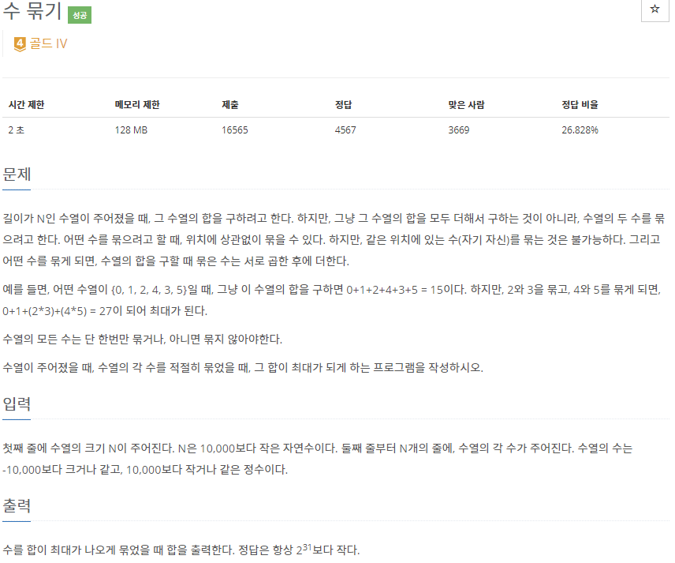
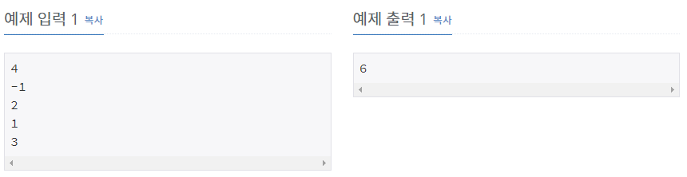

# [[1744] 수 묶기](https://www.acmicpc.net/problem/1744)



___
## 🤔접근
___
## 💡풀이
- <b>탐욕(Greedy) 알고리즘</b>을(를) 사용하였다.
	- 양수는 내림차순으로 정렬하여, 큰 수끼리 곱하여 더한다.
		- 1은 곱하는 것 보다, 더하는 것이 좋으므로 주의하자.
	- 음수는 오름차순으로 정렬하여, 작은 수끼리 곱하여 더한다.
		- 만약 입력에 0이 있다면, 마지막 남은 음수와 곱하여 상쇄시키자.
___
## ✍ 피드백
___
## 💻 핵심 코드
```c++
int main(){
	...
for (int i = 0; i < N; i++) {
		int n;
		cin >> n;
		if (n > 0)
			pos.push(n);
		else if (n < 0)
			neg.push(n);
		else
			zero++;
	}

	long long ans = 0;
	if (!pos.empty()) {
		while (pos.size() > 1) {
			if (pos.top() == 1)
				break;

			long long n = pos.top(); pos.pop();
			if (pos.top() == 1) {
				ans += n + 1;
				pos.pop();
				continue;
			}

			long long m = pos.top(); pos.pop();
			ans += n * m;
		}

		while (!pos.empty()) { // 1은 모두 더함
			ans += pos.top();
			pos.pop();
		}
	}

	if (!neg.empty()) {
		while (neg.size() > 1) {
			long long n = neg.top(); neg.pop();
			long long m = neg.top(); neg.pop();
			ans += n * m;
		}

		if (!zero && !neg.empty()) // 0으로 음수를 상쇄
			ans += neg.top();
	}

	cout << ans;
	...
}
```