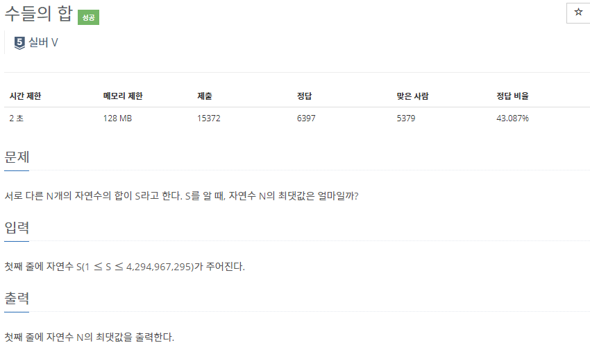
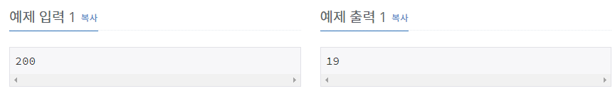

# [[1789] 수들의 합](https://www.acmicpc.net/problem/1789)



___
## 🤔접근
___
## 💡풀이
- <b>탐욕(Greedy) 알고리즘</b>을(를) 사용하였다.
	- 서로 다른 N개의 합이 S일 때, N이 최대가 되려면 1부터 1씩 증가시키면서 더해야 한다.
	- 1부터 1씩 증가시키면서 누적합을 구하면서, 누적합이 S를 넘어서는 시점에서 개수를 1개 빼면, 그것이 답이다.
		> ex) 16: 1+2+3+4+5+6 -> 16초과 -> 답:5 -> 1+2+3+4+6
___
## ✍ 피드백
___
## 💻 핵심 코드
```c++
int main(){
	...
	long long n = 1;
	long long sum = 0;
	while (sum < N) 
		sum += ++n;
	cout << --n;
	...
}
```