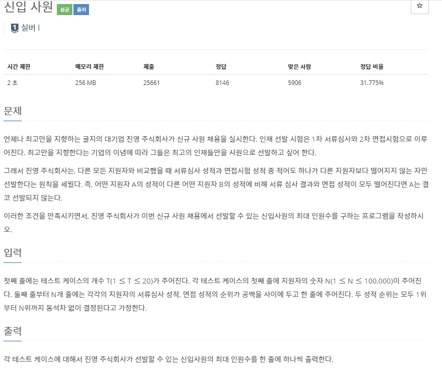
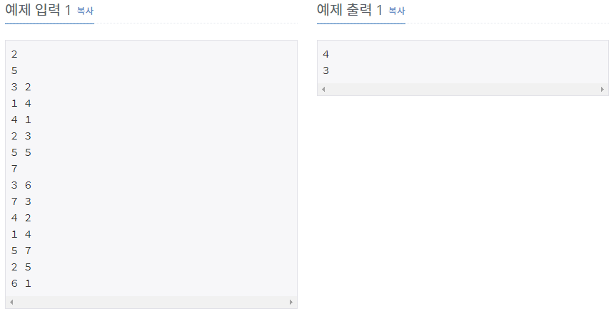

# [[1946] 신입 사원](https://www.acmicpc.net/problem/1946)



___
## 🤔접근
___
## 💡풀이
- <b>탐욕(Greedy) 알고리즘</b>을(를) 사용하였다.
	- 지원자들을 성적 오름차순으로 정렬하고, 항상 이전 지원자보다 1차 성적은 크고, 2차 성적은 작은 지원자만 채용하면, 조건을 만족하면서 최대인원으로 채용할 수 있다.
___
## ✍ 피드백
___
## 💻 핵심 코드
```c++
int main(){
	...
	while (T--) {
		int N;
		cin >> N;
		vector<pair<int, int>> applicant(N);
		for (int i = 0; i < N; i++)
			cin >> applicant[i].first >> applicant[i].second;
		sort(applicant.begin(), applicant.end());

		vector<pair<int, int>> selected;
		selected.push_back(applicant.front());
		for (int i = 1; i < N; i++) {
			if (applicant[i].first > selected.back().first && applicant[i].second < selected.back().second)
				selected.push_back(applicant[i]);
		}

		cout << selected.size() << '\n';
	}
	...
}
```