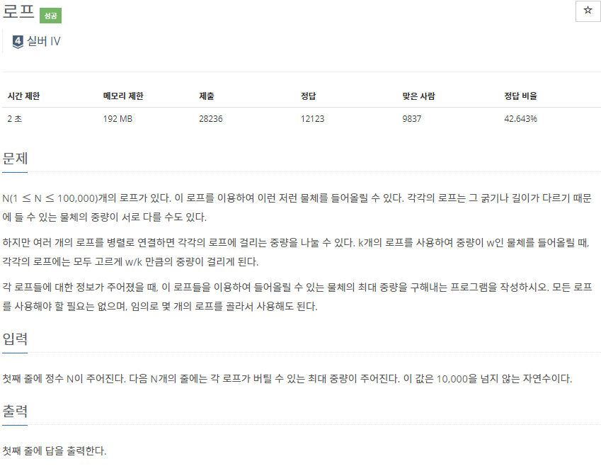
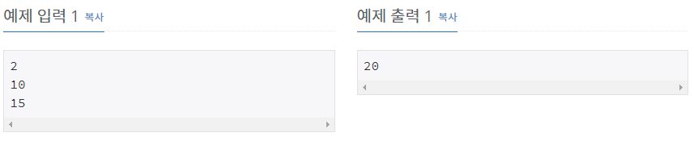

# [[2217] 로프](https://www.acmicpc.net/problem/2217)



___
## 🤔접근
___
## 💡풀이
- <b>탐욕(Greedy) 알고리즘</b>을(를) 사용하였다.
	- 무게 오름차순으로 정렬하고, 작은 무게의 로프를 하나씩 제거하면서 최대 중량을 구하였다.
___
## ✍ 피드백
___
## 💻 핵심 코드
```c++
int main(){
	...
	int ans = 0;
	sort(weight.begin(), weight.end(), greater<int>());
	while (!weight.empty()) {
		ans = max(ans, weight.back() * N--);
		weight.pop_back();
	}

	cout << ans;
	...
}
```