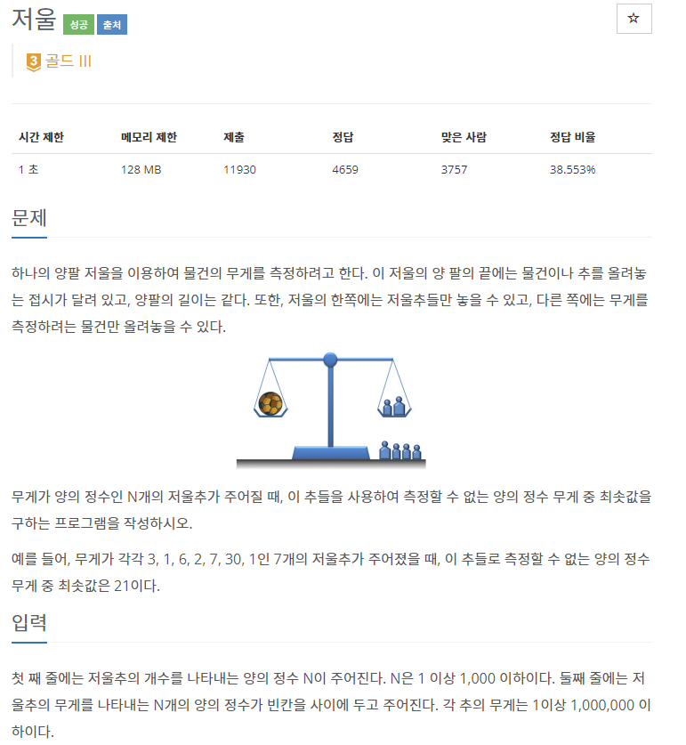
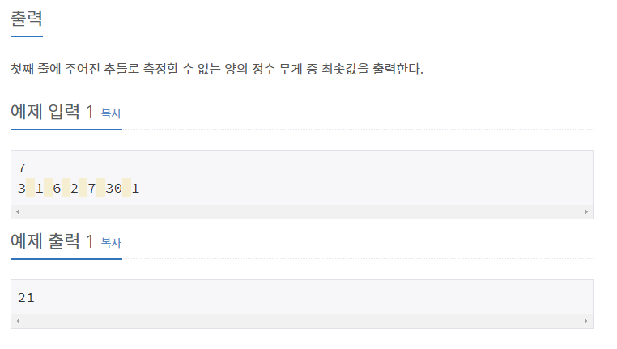

# [[2437] 저울](https://www.acmicpc.net/problem/2437)



___
## 🤔접근
___
## 💡풀이
- <b>알고리즘 & 자료구조</b>
	- `Greedy`
- <b>구현</b>
	- 추를 `오름차순`으로 정렬하고, `누적합`을 이용하여 만들 수 없는 추의 최소 무게를 찾자.
		- `누적합이 S`라면, 해당 추를 이용해서 `[1, S] 사이의 무게`를 만들 수 있음
		- 따라서, `i - 1번째 추까지의 누적합이 S`라 할 때, `i번째 추의 무게`가 `S + 1이 아니라면, S + 1은 절대로 만들 수 없음`
___
## ✍ 피드백
- 이러한 문제를 처음 마주치면 한 번에 풀이를 떠올리기도, 풀이를 증명하기도 까다롭다.
	- 따라서, 경우의 수를 하나씩 그려보면서 풀이를 떠올리는 연습을 많이 해보자!
___
## 💻 핵심 코드
```c++
int main() {
	...

	sort(v.begin(), v.end());

	long long sum = 0;
	for (int i = 0; i < N; i++) {
		if (sum + 1 < v[i]) 
			break;

		sum += v[i];
	}
	cout << sum + 1;

	...
}
```