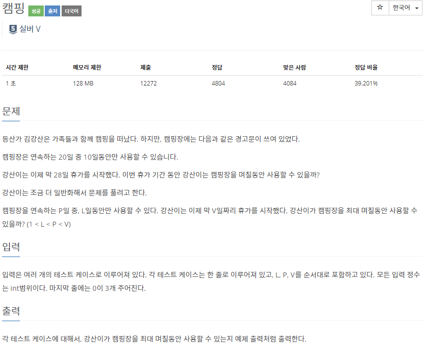
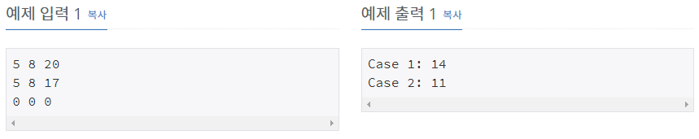

# [[4796] 캠핑](https://www.acmicpc.net/problem/4796)



___
## 🤔접근
___
## 💡풀이
- <b>탐욕(Greedy) 알고리즘</b>을(를) 사용하였다.
	- V일짜리 휴가 중 P일이 총 몇 번 있는지 카운트하여 사용할 수 있는 L일을 곱하고, 남은 휴가 일 수는 V % P으로 구하여 두 값을 더하면, 최대 며칠동안 사용할 수 있는지 알 수 있다.
	- <b>주의: </b>V % P이 L을 초과해서는 안 된다.
___
## ✍ 피드백
- <b>반례</b>
	```c
	2 8 20
	0 0 0
	
	answer : 6
	wrong answer : 8
	```
___
## 💻 핵심 코드
```c++
int main(){
	...
	int ans = 0;
	while (card.size() > 1) {
		int sum = card.top();
		card.pop();
		sum += card.top();
		card.pop();
		card.push(sum);
		ans += sum;
	}
	
	cout << ans;
	...
}
```