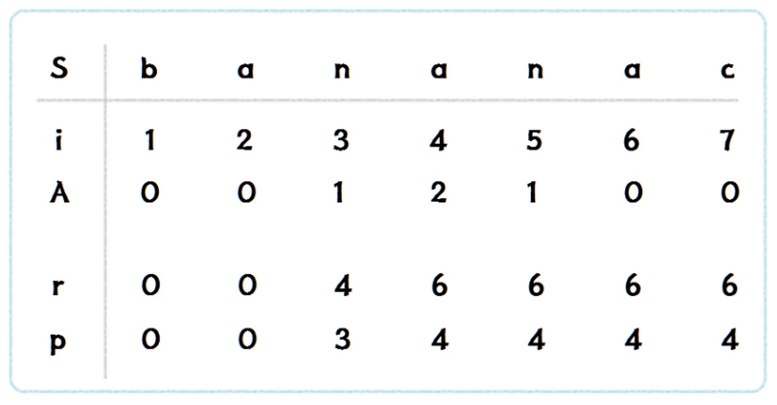

# Manacher
## 📖개념
- 1975년에 발표된 Manacher 알고리즘은 `특정 문자를 중심으로 하는 팰린드롬 중 가장 긴 홀수 팰린드롬의 길이`를 찾는 알고리즘이다.
- Manacher 알고리즘은 `팰린드롬에서 가지는 대칭성`을 이용하여, 이전에 한 번 탐색한 구간에 대한 정보를 활용한다.
- 시간 복잡도: `O(N)`
## 🔗동작 원리
- <b>변수 정의</b>
    - `A[i]`: i번째 문자를 중심으로 하는 가장 긴 팰린드롬의 반지름 길이
        - i - A[i] ~ i + A[i] : 팰린드롬
    - `r`: 현재 속하는 팰린드롬의 맨 오른쪽 인덱스
    - `p`: 현재 속하는 팰린드롬의 중심 인덱스
- <b>변환 작업</b>
    - Manacher 알고리즘은 홀수의 팰린드롬 길이만 구할 수 있으므로, 문자열을 약간 변환해주어야 한다.
    - 문자열 양 끝과, 사이사이에 임의의 문자(`#`)를 집어넣음으로써, 문자열의 길이를 홀수로 강제해주자.
- <b>구현</b>
    1. 문자열을 하나씩(`i`) 탐색한다.
    2. `i`와 `r`의 대소 관계에 따라 `A[i]`의 초기값이 결정된다.
        1. `i ≤ r`: `A[i]` = `min(A[2 * p - i], r - i)`
            - i번째 문자는 p번째 문자가 중심인 팰린드롬에 속한다.
                - 그리고 팰린드롬에서 `i의 대칭`은 `2 * p - i`이 된다.
            - 보통은, `A[i]`의 초기값을 `A[i의 대칭]`으로 해도 되지만, 아래의 반례가 존재함에 유의하자.
                > ex) `baba`
                > - 4번째 a의 `A[4] 초기값`을 `A[2 * p - i]`으로 하면, `A[4] = A[2] = 1`이 되는데, 이는 잘못된 값이다.
                > - 따라서, 이 때는 `A[4]`에 `r - i`을 대입해주어야 한다.
            - 그러므로, `A[i]`에는 `min(A[2 * p - i], r - i)`을 대입해주자.
        2. `i > r`: `A[i]` = `0`
            - i번째 문자는 p번째 문자가 중심인 팰린드롬에 속하지 않는다.
            - 따라서, i번째 문자를 중심으로 하는 팰린드롬의 반지름 길이는 0
    3. `A[i]`의 초기값을 결정하고, `str[i - A[i] - 1]` == `str[i + A[i] + 1]` 을 만족하지 않을 때 까지 `A[i]`를 1씩 증가시킨다.
        - 팰린드롬 부분 문자열을 확장해가는 과정이다.
    4. 팰린드롬이 부분 문자열이 확장되었다면(`r` < `i + A[i]`), r과 p를 갱신해준다.
        - r = i + A[i]
        - p = i
    5. 위의 과정이 모두 끝나면, `A[]`에서 가장 긴 팰린드롬의 반지름 길이를 반환한다.
        - 변환 작업에 의해, 여기서 반환하는 길이는 결국 `특정 문자를 중심으로 하는 팰린드롬 중 가장 긴 팰린드롬의 길이`가 된다.
- <b>예시</b><br>
    
## 💻구현 코드
```c++
string convert(const string& str) {
    int len = str.size();
    string res = "";

    for (int i = 0; i < len; i++) {
        res += '#';
        res += str[i];
    }
    res += '#';

    return res;
}

int manachers(const string& S) {
    string str = convert(S);
    int r = 0, p = 0;
    int N = str.size();
    vector<int> A(N);

    for (int i = 0; i < N; i++) {
        if (i <= r)
            A[i] = min(A[2 * p - i], r - i);
        else
            A[i] = 0;

        while (i - A[i] - 1 >= 0 && i + A[i] + 1 < N && str[i - A[i] - 1] == str[i + A[i] + 1])
            A[i]++;

        if (r < i + A[i]) {
            r = i + A[i];
            p = i;
        }
    }

    return *max_element(A.begin(), A.end());
}
```