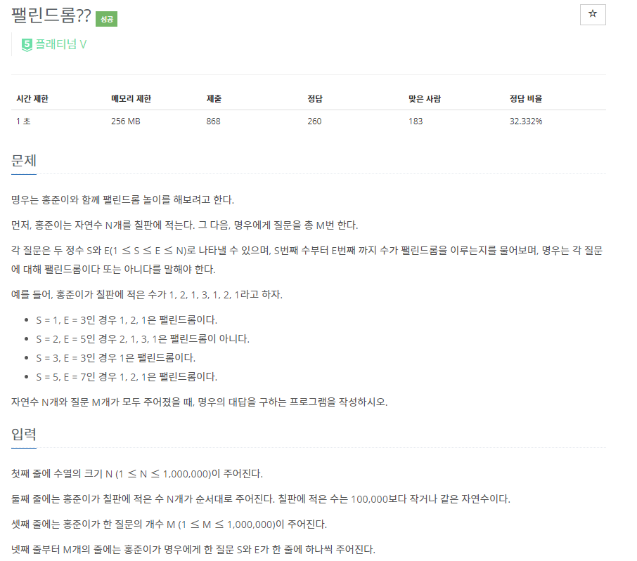

# [[11046] 팰린드롬??](https://www.acmicpc.net/problem/11046)



___
## 🤔접근
___
## 💡풀이
- <B>알고리즘 & 자료구조</B>
	- `Manacher`
___
## ✍ 피드백
- 칠판에 적은 수는 10만 이하의 숫자 이므로, 배열에 각각 입력해서 팰린드롬인지 판별해야 한다.
    - 배열의 각 값들을 하나의 문자라고 생각하자.
- S와 E 사이의 자연수가 팰린드롬인지 확인하기 위해 S와 E 중간 위치의 `A[mid]`(mid번째 문자를 중심으로 하는 가장 긴 팰린드롬의 반지름 길이)를 구하고, E - S + 1과 같은지 비교하자.
    - 쿼리마다 각각 Manacher 알고리즘을 수행하면 시간초과이므로 주의!
___
## 💻 핵심 코드
```c++
vector<int> A;

vector<int> convert(const vector<int>& str) {
    int len = str.size();
    vector<int> res;

    for (int i = 0; i < len; i++) {
        res.push_back(0);
        res.push_back(str[i]);
    }
    res.push_back(0);

    return res;
}

void manachers(const vector<int>& S) {
    vector<int> str = convert(S);
    int r = 0, p = 0;
    int N = str.size();
    A.resize(N);

    for (int i = 0; i < N; i++) {
        if (i <= r)
            A[i] = min(A[2 * p - i], r - i);
        else
            A[i] = 0;

        while (i - A[i] - 1 >= 0 && i + A[i] + 1 < N && str[i - A[i] - 1] == str[i + A[i] + 1])
            A[i]++;

        if (r < i + A[i]) {
            r = i + A[i];
            p = i;
        }
    }
}

int main() {
    ...

    manachers(str);

    for (int i = 0; i < T; i++) {
        int src, dest;
        cin >> src >> dest;

        if (A[((src * 2 - 1) + (dest * 2 - 1)) / 2] >= dest - src + 1)
            cout << 1 << '\n';
        else
            cout << 0 << '\n';
    }

    return 0;
}
```