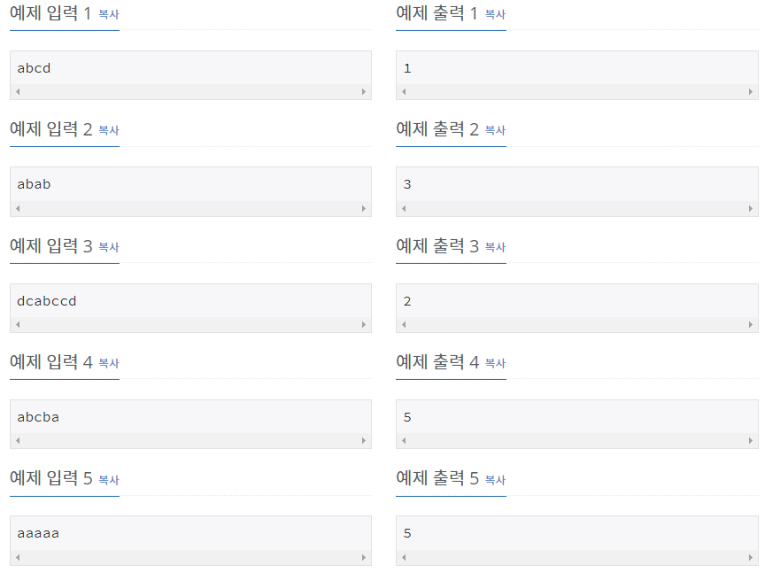

# [[13275] 가장 긴 팰린드롬 부분 문자열](https://www.acmicpc.net/problem/13275)



___
## 🤔접근
___
## 💡풀이
- <B>알고리즘 & 자료구조</B>
	- `Manacher`
___
## ✍ 피드백
___
## 💻 핵심 코드
```c++
string convert(const string& str) {
    int len = str.size();
    string res = "";

    for (int i = 0; i < len; i++) {
        res += '#';
        res += str[i];
    }
    res += '#';

    return res;
}

int manachers(const string& S) {
    string str = convert(S);
    int r = 0, p = 0;
    int N = str.size();
    vector<int> A(N);

    for (int i = 0; i < N; i++) {
        if (i <= r)
            A[i] = min(A[2 * p - i], r - i);
        else
            A[i] = 0;

        while (i - A[i] - 1 >= 0 && i + A[i] + 1 < N && str[i - A[i] - 1] == str[i + A[i] + 1])
            A[i]++;

        if (r < i + A[i]) {
            r = i + A[i];
            p = i;
        }
    }

    return *max_element(A.begin(), A.end());
}
```