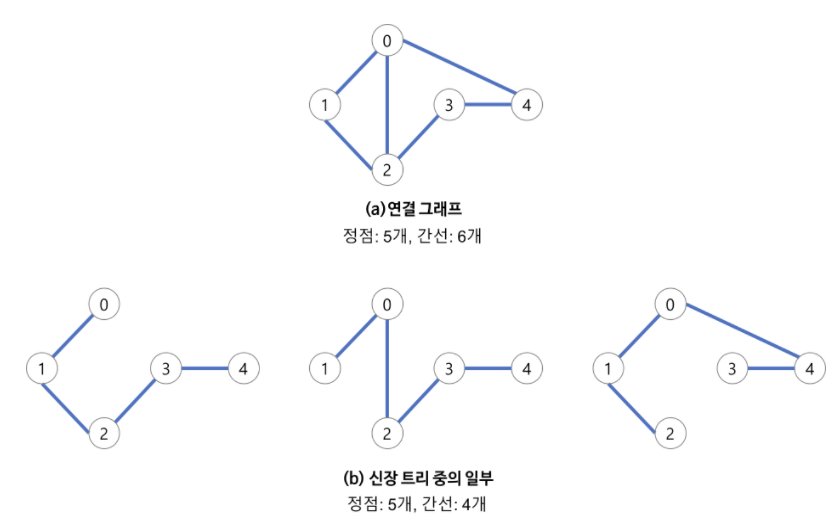
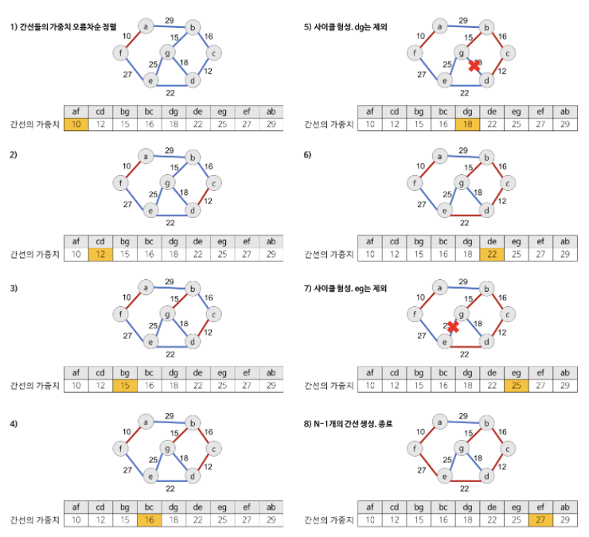
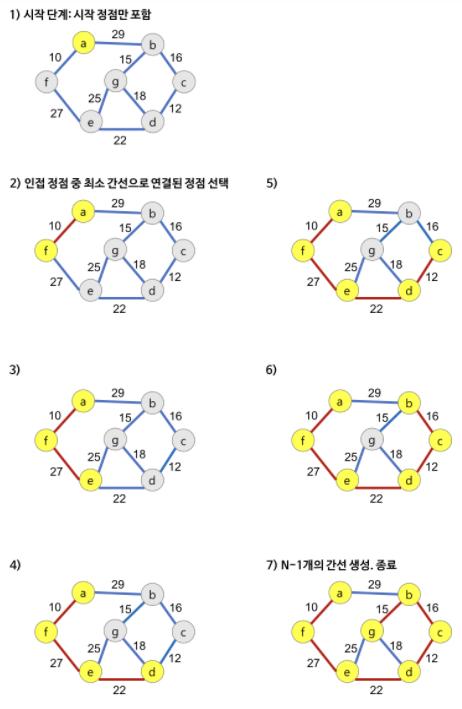

# 최소 신장 트리(MST, Minimum Spanning Tree) 알고리즘

## 신장 트리(Spanning Tree)
- <b>📖개념</b>
	- `그래프 내의 모든 정점을 포함하는 트리`
	- 최소 연결 부분 그래프
	- n개의 정점을 갖는 그래프의 최소 간선의 수는 (n-1)개이고, 이는 필연적으로 트리 형태가 된다.
- <b>✅특징</b>
	- 
	- DFS or BFS을 이용하면 그래프에서 신장 트리를 찾을 수 있다.
	- 하나의 그래프에는 여러 신장 트리가 존재할 수 있다.
	- 신장 트리는 트리의 특수한 형태이므로, `모든 정점들이 연결`되어 있어야 하고, `사이클이 없어야`한다.
	- 따라서 신장 트리는 그래프에 있는 `n개의 정점을 정확히 (n-1)개의 간선으로 연결`한다.
___
## 최소 신장 트리(MST)
- <b>📖개념</b>
	- 신장 트리 중에서 사용된 `간선들의 가중치 합이 최소`인 트리
	- 각 간선의 가중치가 동일하지 않을 때, 단순히 적은 수의 간선을 사용한다고 반드시 최소 비용이 얻어지는 것은 아니다.
	- 간선의 가중치를 고려하여 최소 비용의 신장 트리를 선택하는 것을 뜻함
	- 즉, 그래프의 모든 정점들을 `가장 적은 수의 간선과 비용`으로 연결하는 것이다.
- <b>✅특징</b>
	- 간선의 가중치 합이 최소여야 한다.
	- n개의 정점을 갖는 그래프에 대해 반드시 (n-1)개의 간선만 사용해야 한다.
	- 사이클이 없어야 한다.
### 구현 방법
1. <b>⭐Kruskal MST 알고리즘⭐</b>
	- <b>📖개념</b>
		- `가중치가 가장 작은 간선`부터 시작해서 신장 트리 집합을 단계적으로 확장해나가는 방식
	- <b>✅특징</b>
		- MST의 특징 ¹최소 비용의 간선으로 구성, ²사이클 미포함의 조건에 근거하여 `각 단계에서 사이클을 이루지 않는 최소 비용 간선을 선택`한다.
		- `간선 선택을 기반`으로 하는 알고리즘이다.
		- 이전 단계에서 만들어진 신장 트리와는 상관없이, 무조건 최소 간선만을 선택하는 방법이다.
	- <b>🧐과정</b>
		- 
		1. 그래프의 간선들을 가중치의 오름차순으로 정렬
		2. 순서대로 사이클을 형성하지 않는 간선을 선택
			- <b>사이클 생성 여부 확인 방법</b>
				- `disjoint-set`을 이용하여 추가하려는 두 정점이 서로소 집합인지 검사한다.
		3. 해당 간선을 현재의 MST의 집합에 추가
	- <b>⏳시간 복잡도</b>
		- `O(|E|log₂|E|)`
		- 그래프 내에 적은 숫자의 간선을 갖는 `희소 그래프(Sparse Graph)`의 경우에 적합한 알고리즘이다.
	- <b>💻구현 코드</b>
		```c++
		int V; // 정점 개수
		vector<vector<pair<int, int>>> adj; // 그래프 인접 리스트(연결된 정점 번호, 간선 가중치)
		vector<int> par;
		vector<int> _rank;

		int find(int);
		void merge(int, int);

		int kruskal() {
			int res = 0;
			vector<pair<int, int>> MST; // 최소 신장 트리에 포함된 간선 목록
			vector<pair<int, pair<int, int>>> edges; // 간선 (가중치, (정점1, 정점2))

			for (int u = 1; u <= V; u++) {
				for (int i = 0; i < adj[u].size(); i++) {
					int v = adj[u][i].first;
					int weight = adj[u][i].second;
					edges.emplace_back(weight, make_pair(u, v));
				}
			}
			sort(edges.begin(), edges.end()); // 간선 가중치 오름차순으로 정렬

			for (int i = 0; i < edges.size(); i++) {
				int weight = edges[i].first;
				int u = edges[i].second.first;
				int v = edges[i].second.second;

				if (find(u) == find(v)) // 사이클 방지
					continue;

				merge(u, v);
				MST.emplace_back(u, v);
				res += weight;
			}

			return res; // 최소 신장 트리의 가중치 합
		}	

		int find(int u) {
			if (u == par[u])
				return u;
			return par[u] = find(par[u]);
		}

		void merge(int u, int v) {
			u = find(u);
			v = find(v);

			if (u == v)
				return;
			if (_rank[u] < _rank[v])
				swap(u, v);

			par[v] = u;

			if (_rank[u] == _rank[v])
				_rank[u]++;
		}	
		```
	___
2. <b>⭐Prim MST 알고리즘⭐</b>
	- <b>📖개념</b>
		- `시작 정점에서 출발`하여 신장 트리 집합을 단계적으로 확장해나가는 방식.
	- <b>✅특징</b>
		- `정점 선택을 기반`으로 하는 알고리즘이다.
		- 이전 단계에서 만들어진 신장 트리를 확장하는 방법이다.
	- <b>🧐과정</b>
		- 
		1. 시작 단계에서는 시작 정점만이 MST 집합에 포함됨
		2. 앞 단계에서 만들어진 MST 집합에 인접한 정점들 중 최소 간선으로 연결된 정점을 선택하여 트리를 확장
			- 가중치가 가장 낮은 정점을 먼저 선택
		3. 위의 과정을 트리가 (n-1)개의 간선을 가질 때까지 반복
	- <b>⏳시간 복잡도</b>
		- `O(|V|²)`
		- 그래프에 간선이 많이 존재하는 `밀집 그래프(Dense Graph)`의 경우에 적합한 알고리즘이다.
		- `우선순위 큐`를 이용하여 구현하는 방법도 존재한다.
			- `O(|E|log₂|V|)`
	- <b>💻구현 코드</b>
		```c++
		int V; // 정점 개수
		vector<vector<pair<int, int>>> adj; // 그래프 인접 리스트(연결된 정점 번호, 간선 가중치)
		
		int prim() {
			int res = 0;
			vector<pair<int, int>> MST; // 최소 신장 트리에 포함된 간선 목록
			vector<bool> added(V, false); // 해당 정점이 트리에 포함?
			vector<int> minWeight(V, INF); // 트리와 정점을 연결하는 간선의 최소 가중치
			vector<int> par(V, -1); // 트리와 정점을 연결하는 간선의 다른 한쪽 끝 정점
		
			minWeight[0] = par[0] = 0;
			for (int i = 0; i < V; i++) {
				int u = -1;
		
				for (int v = 1; v <= V; v++)
					if (!added[v] && (u == -1 || minWeight[u] > minWeight[v])) // 정점 v가 MST에 속하지 않고, 현재까지 탐색한 가중치보다 더 작은 가중치 간선을 가진다면, 정점 u로 갱신
						u = v;
		
				if (par[u] != u) 
					MST.emplace_back(par[u], u); // 정점 u를 MST에 추가
				res += minWeight[u];
				added[u] = true; // 정점 u가 MST에 포함되어 있음을 표시
		
				for (int i = 0; i < adj[u].size(); i++) { // 정점 u에 연결된 정점들 탐색
					int v = adj[u][i].first;
					int weight = adj[u][i].second;
		
					if (!added[v] && minWeight[v] > weight) { // 정점 v가 MST에 포함되지 않고, (u, v)의 가중치가 현재까지 탐색한 정점 v의 간선 중 최소인 경우
						par[v] = u; // 정점 v을 MST의 정점 u와 연결 
						minWeight[v] = weight; // (u, v)의 가중치
					}
				}
			}
		
			return res; // 최소 신장 트리의 가중치 합
		}		
		```
### 두 알고리즘의 정당성 증명
- 두 알고리즘은 `탐욕적인 방법(greedy method)`을 이용하여 그래프의 모든 정점을 최소 비용으로 연결하는 최적 해답을 구하는 방식이다.
- 탐욕적 선택 속성은 다음과 같이 `귀류법`으로 증명할 수 있다.
	1. 각 알고리즘이 선택하는 간선 중 그래프의 최소 스패닝 트리 T에 포함되지 않는 간선이 있다고 가정하자.
	2. 이 중 첫 번째로 선택되는 간선을 (u, v)라고 하자. T는 이 간선을 포함하지 않으니, u와 v는 T 상에서 다른 경로로 연결되어 있을 것이다.
		- 주목할 점은 이 경로를 이루는 간선 중 하나는 반드시 (u, v)와 가중치가 같거나 커야 한다는 점이다.
		- 이 간선들이 모두 (u, v)보다 가중치가 작다면, 이미 이 간선들을 모두 선택해서 u와 v를 연결하여, 애초에 (u, v)가 선택될 일이 없었을 것이다.
	3. 이 경로 상에서 (u, v) 이상의 가중치를 갖는 간선을 하나 골라 T에서 지워버리고 (u, v)를 추가해보자.
		- 이 결과도 여전히 신장 트리이며, 가중치의 총합은 반드시 줄어들게 된다.
	4. T가 이미 최소 신장 트리라고 가정했으므로, 이 변경을 거친 결과는 (u, v)를 포함하면서도 최소 신장 트리가 되어야 함을 알 수 있다.
	5. 따라서 (u, v)를 선택한다고 해도, 남은 간선들을 잘 선택하면 항상 최소 신장 트리를 얻을 수 있다.
	6. 이 속성은 마지막 간선을 추가해서 신장 트리를 완성할 때까지 성립하므로, 마지막에 얻은 트리는 항상 최소 신장 트리가 된다.
___
