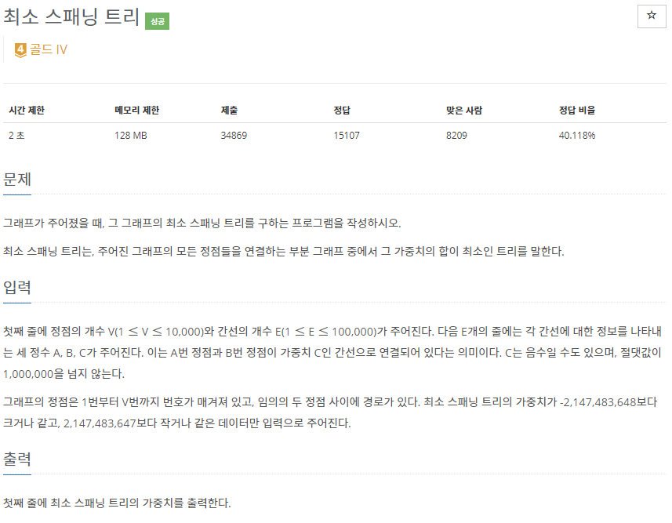

# [[1197] 최소 스패닝 트리](https://www.acmicpc.net/problem/1197)



___
## 🤔접근
1. <b>최소 신장 트리를 구하는 문제이다.</b>
	- 프림 알고리즘: O(|V|²) -> 10,000² (TLE)
	- 크루스칼 알고리즘: O(|E|log₂|E|) -> 100,000 * 16.xxx
___
## 💡풀이
- <b>크루스칼(Kruskal) 알고리즘</b>을(를) 사용하였다.
__
## ✍ 피드백
___
## 💻 핵심 코드
```c++
int kruskal() {
	int res = 0;
	vector<pair<int, int>> MST;
	vector<pair<int, pair<int, int>>> edges;

	for (int u = 1; u <= V; u++) {
		for (int i = 0; i < adj[u].size(); i++) {
			int v = adj[u][i].first;
			int weight = adj[u][i].second;
			edges.emplace_back(weight, make_pair(u, v));
		}
	}
	sort(edges.begin(), edges.end());

	for (int i = 0; i < edges.size(); i++) {
		int weight = edges[i].first;
		int u = edges[i].second.first;
		int v = edges[i].second.second;

		if (find(u) == find(v))
			continue;

		merge(u, v);
		MST.emplace_back(u, v);
		res += weight;
	}

	return res;
}

int find(int u) {
	if (u == par[u])
		return u;
	return par[u] = find(par[u]);
}

void merge(int u, int v) {
	u = find(u);
	v = find(v);

	if (u == v)
		return;
	if (_rank[u] < _rank[v])
		swap(u, v);

	par[v] = u;

	if (_rank[u] == _rank[v])
		_rank[u]++;
}
```