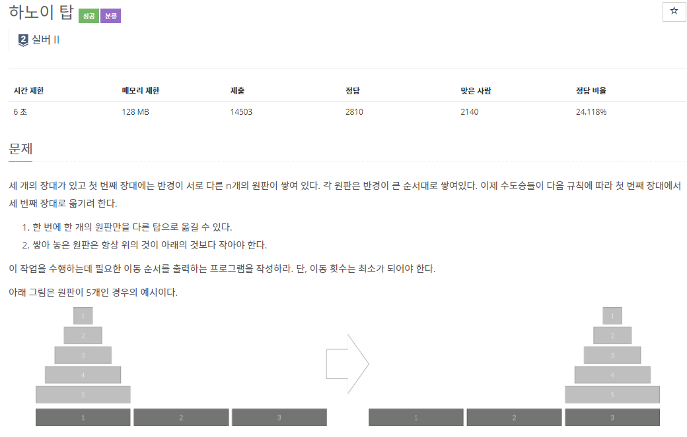
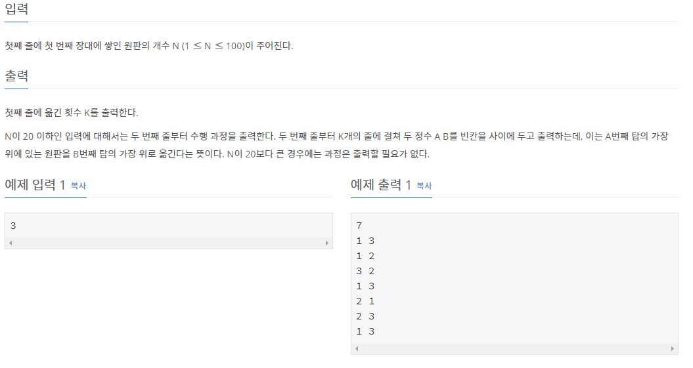

# [[1914] 하노이 탑](https://www.acmicpc.net/problem/1914)




___
## 💡풀이
- 하노이 탑에서 원판들을 최소의 방법으로 다른 탑으로 이동시키는 과정을 재귀함수를 이용하여 구현하였다.
	- 재귀함수를 구현할 때, 먼저 작은 예시들로부터 아이디어를 얻는 것이 중요하다.
	- `hanoi(n) : n개의 원판을 다른 탑으로 옮길 수 있는 최소 이동 횟수` 라고 정의해보자.
		> ex) n = 3일 때, hanoi(3)의 최소 이동 경로를 직접 구해보면 다음과 같다.
		> - 1 -> 3
		> - 1 -> 2
		> - 3 -> 2
		> - 1 -> 3
		> - 2 -> 1
		> - 2 -> 3
		> - 1 -> 3
	- 위의 작은 예시에서 큰 문제(n = 3)와 작은 문제(n = 2)의 연관성을 찾아보자.
		- hanoi(3)을 구하기 위해 다음과 같이 진행된다.
			1. 출발 탑의 1, 2 원판을 중간 탑으로 옮긴다.
			2. 출발 탑의 3 원판을 도착 탑으로 옮긴다.
			3. 중간 탑의 1, 2 원판을 도착 탑으로 옮긴다.
		- 즉, hanoi(2) 두 번과 한 번의 이동이 발생하였다.
		- 추가로, 파라미터에 출발 탑, 중간 탑, 도착 탑에 대한 인덱스 정보가 필요해 보이므로 추가하여 다음과 같이 재귀식을 도출해보자.
			- `hanoi(n, start, by, dest)`를 구하려면
				1. `hanoi(n - 1, start, dest, by)`: 출발 탑에 있는 n-1개의 원판을 중간 탑으로 옮긴다.
				2. 출발 탑에 있는 n번째 원판을 도착탑으로 옮긴다.
				3. `hanoi(n - 1, by, start, dest)`: 중간 탑에 있는 n-1개의 원판을 도착 탑으로 옮긴다.
			- n이 1이라면, 중간 탑을 거칠 필요 없이, 바로 도착 탑으로 옮기는 `하나의 과정`만 필요하다.
				- 즉, 재귀호출이 필요가 없으므로 이는 기저 조건(base condition), 재귀함수 탈출 조건에 해당한다.
		- 재귀함수를 구현하였다면, 다음의 점화식도 얻을 수 있다.
			- `hanoi(n) = 2 * hanoi(n - 1) + 1`
			- 1부터 n까지의 이동 횟수를 모두 더해야 n개의 원판을 다른 탑으로 옮길 수 있는 최소 이동 횟수이므로, 일반항을 구하면 다음과 같다.
				- `hanoi(n) = 2^(n - 1) - 1`
				- 등비수열의 합 공식을 이용하면 `2ⁿ - 1`임을 알 수 있다.
- 또 하나의 문제는 입력 n이 최대 100까지 들어올 수 있기 때문에, 단순히 int나 long long 자료형을 사용했다간 overflow가 발생하여 원하는 결과를 얻을 수 없다는 것이다.
	- 그러므로 BigInteger을 string 클래스를 이용하여 구현해야한다.
		- `double pow(2, n)`의 결과를 to_string 메소드로 string으로 변환하고, double형의 결과를 문자열로 변환하였으니 소수점 이하의 숫자를 제거해준다.
		- 다음으로 문자열 맨 끝에서 1을 빼주면 원하는 결과를 얻을 수 있게 된다.
___
## ✍ 피드백

___
## 💻 핵심 코드
```c++
string BigInteger(double val) {
	string answer = to_string(val);
	answer = answer.substr(0, answer.find('.'));
	answer[answer.size() - 1] -= 1;
	return answer;
}

void hanoi(int n, int start, int by, int dest) {
	if (n == 1) {
		cout << start << ' ' << dest << '\n';
		return;
	}
	
	hanoi(n - 1, start, dest, by);
	cout << start << ' ' << dest << '\n';
	hanoi(n - 1, by, start, dest);
}
```