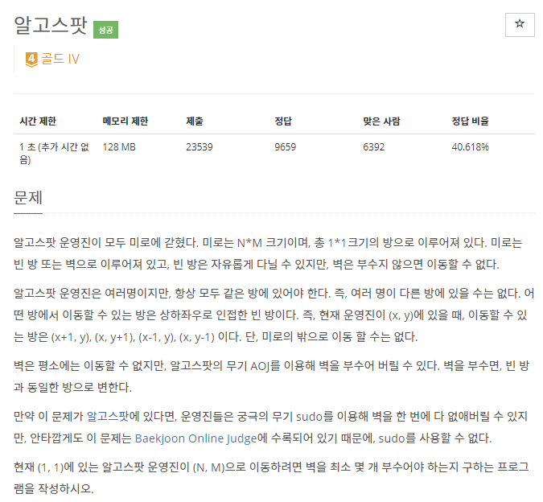
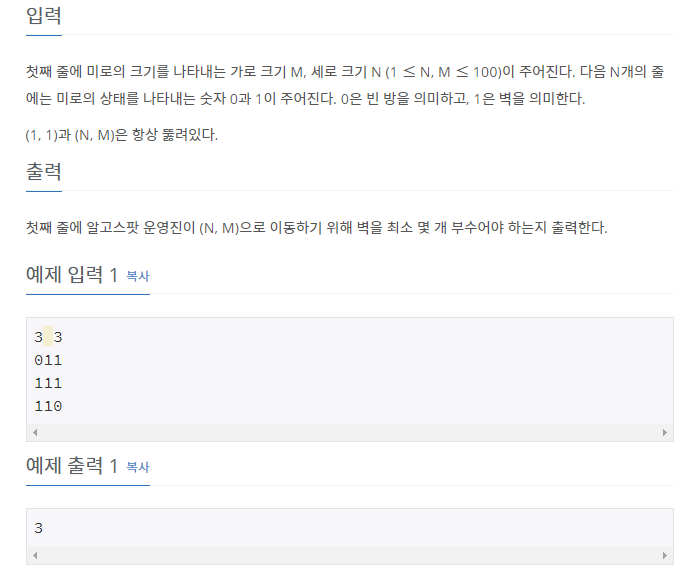

# [[1261] 알고스팟](https://www.acmicpc.net/problem/1261)




___
## 🤔접근
1. <b>벽이 있는 위치로 이동하는 비용은 1이고, 벽이 없는 위치로 이동하는 비용은 0이다.</b>
	- 간선 가중치가 두 종류만 존재할 때 최단 거리를 구하는 최적의 알고리즘은 `0-1 BFS`이다.
___
## 💡풀이
- <B>알고리즘 & 자료구조</B>
	- `0-1 BFS`
- <b>구현</b>
	- 0-1 BFS 알고리즘을 구현하여 해결 함.
___
## ✍ 피드백
___
## 💻 핵심 코드
```c++
int BFS(const vector<vector<int>>& v, const int& N, const int& M) {
	vector<vector<bool>> isVisited(N, vector<bool>(M));

	deque<pair<int, pair<int, int>>> dq;
	dq.emplace_back(0, make_pair(0, 0));
	while (!dq.empty()) {
		int cost = dq.front().first;
		int row = dq.front().second.first;
		int col = dq.front().second.second;
		dq.pop_front();

		if (row == N - 1 && col == M - 1) 
			return cost;

		for (int i = 0; i < 4; i++) {
			int nextRow = row + dr[i];
			int nextCol = col + dc[i];

			if (nextRow < 0 || nextCol < 0 || nextRow >= N || nextCol >= M)
				continue;
			if (isVisited[nextRow][nextCol])
				continue;

			isVisited[nextRow][nextCol] = true;
			if (v[nextRow][nextCol] == 1)
				dq.emplace_back(cost + 1, make_pair(nextRow, nextCol));
			else
				dq.emplace_front(cost, make_pair(nextRow, nextCol));
		}
	}
}
```