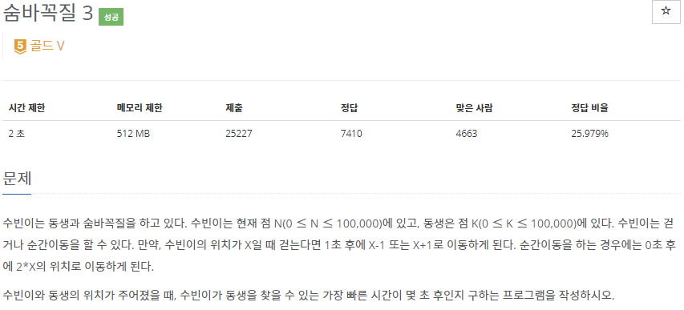
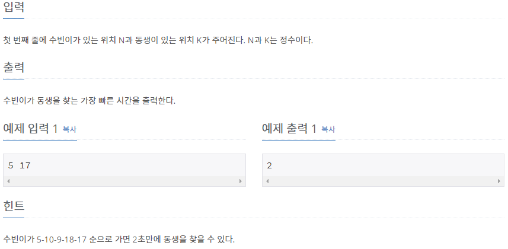

# [[13549] 숨바꼭질 3](https://www.acmicpc.net/problem/13549)



___
## 🤔접근
1. <b>1칸 이동은 1초가 소요되고, 순간 이동은 0초가 소요된다.</b>
	- 가중치가 1인 간선과 0인 간선이 있다고 생각하자.
		- 이 경우, 다익스트라보다 훨씬 효율적인 0-1 BFS를 사용하는 편이 좋다.
___
## 💡풀이
- <b>0-1 BFS 알고리즘</b>을(를) 이용하였다.
	- 순간이동(간선 가중치 0)할 때는, 방문하지 않은 위치이면 덱의 앞에 push
	- 한 칸 이동(간선 가중치 1)할 때는, 방문하지 않은 위치이면 덱의 뒤에 push
- 시간 복잡도: `O(E + V)`
___
## ✍ 피드백
1. <b>단순 BFS는 사용할 수 없다.</b>
	- 단순 BFS는 `간선 가중치가 모두 동일하거나 없어야 한다`는 전제조건이 필요하다.
___
## 💻 핵심 코드
```c++
int BFS() {
	deque<pair<int, int>> q; // 0-1 BFS는 deque 사용
	q.emplace_back(0, N);
	visited[N] = true;

	while (!q.empty()) {
		auto p = q.front(); q.pop_front();
		int seconds = p.first;
		int location = p.second;
		
		if (location == K)
			return seconds;

		if (location * 2 < MAX && !visited[location * 2]) {
			q.emplace_front(seconds, location * 2);
			visited[location * 2] = true;
		}
		if (location + 1 < MAX && !visited[location + 1]) {
			q.emplace_back(seconds + 1, location + 1);
			visited[location + 1] = true;
		}
		if (location - 1 >= 0 && !visited[location - 1]) {
			q.emplace_back(seconds + 1, location - 1);
			visited[location - 1] = true;
		}
	}
}
```