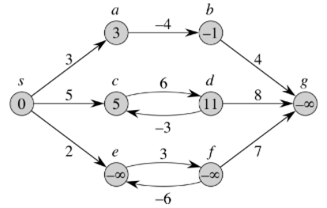
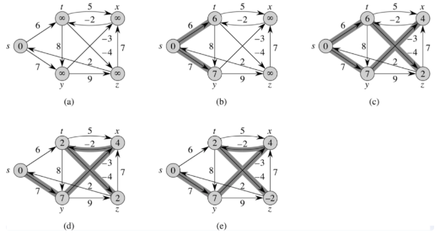

# 벨만 포드(Bellman-Ford) 알고리즘

## 📖개념
- `단일 시작점` 최단 경로 알고리즘으로, 시작 정점에서 다른 정점들까지의 최단 경로를 계산할 수 있다.
- 순회와 완화 과정으로 진행되며, 가중치가 `음수`일 때도 사용 가능하다.
	- 각 정점을 `V - 1번 순회`하면서, 각각 저장된 `최단 경로`가 현재보다 짧은지 확인하고 갱신하는 `완화` 과정으로 이루어진다.
- <b>음수 사이클 확인</b><br>
	
	- 벨만 포드 알고리즘은 최대 V - 1번 순회한다.
	- 여기서 추가적인 `V번째 순회에서 완화`가 발생한다면, `음수 사이클`이 존재한다는 의미이다.
	- 완화가 끝까지 진행된 경우, 더 이상 갱신되어야 할 최단 거리가 없어야 하지만,<br>
	음수 사이클이 존재하는 경우, 경로를 추가할 때 마다 무한히 최단 경로를 업데이트할 수 있기 때문이다.
- <b>시간 복잡도</b>
	- `O(|V|*|E|)`
### 벨만 포드(Bellman-Ford) 과정

___
## 💻구현
```c++
void bellman_ford(const vector<vector<pair<int, int>>> adj, vector<long long>& dist, const int& start) {
	int n = dist.size() - 1;
	dist[start] = 0;

	for (int i = 1; i < n; i++) {
		for (int cur = 1; cur <= n; cur++) {
			if (dist[cur] == INF)
				continue;

			for (auto next : adj[cur]) 
				dist[next.first] = min(dist[next.first], dist[cur] + next.second);
		}
	}
}
```
```c++
// 음수 사이클 확인
bool bellman_ford(const vector<vector<pair<int, int>>> adj, vector<long long>& dist, const int& start) {
	bool isNegativeCycle = false;
	int n = dist.size();
	dist[start] = 0;

	for (int i = 1; i < n; i++) {
		for (int cur = 1; cur < n; cur++) {
			if (dist[cur] == INF)
				continue;

			for (auto next : adj[cur]) {
				if (dist[next.first] > dist[cur] + next.second) {
					dist[next.first] = dist[cur] + next.second;
					if (i == n - 1)
						isNegativeCycle = true;
				}
			}
		}
	}

	return isNegativeCycle;
}
```