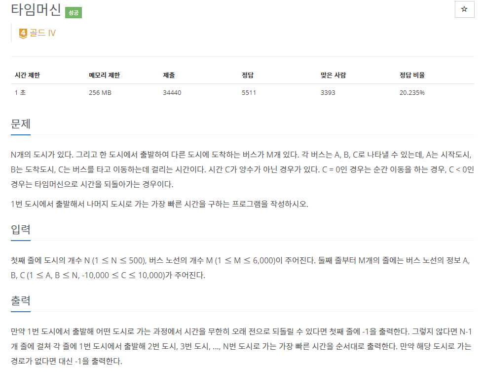
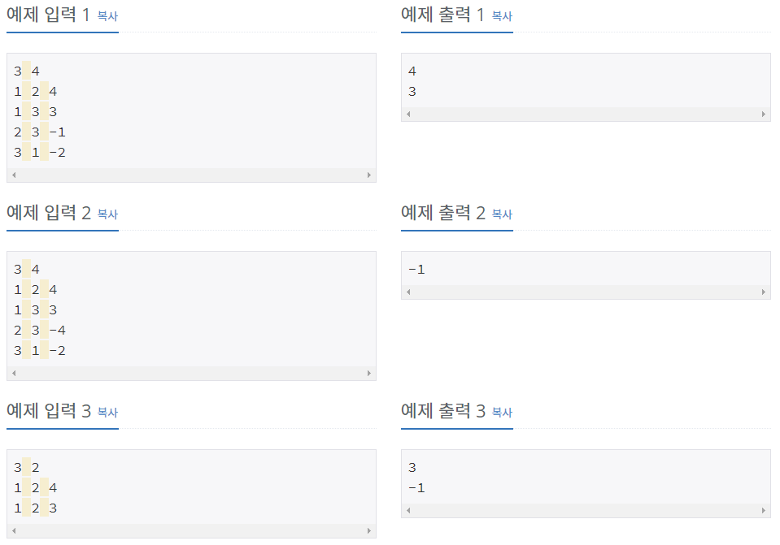

# [[11657] 타임머신](https://www.acmicpc.net/problem/11657)



___
## 🤔접근
- 음의 가중치가 존재하는 최소 경로 찾기 문제이다.
	- 플로이드-와샬 알고리즘은 O(V³)이므로 시간초과, 따라서 벨만-포드 알고리즘(O(V*E))을 사용하자.
___
## 💡풀이
- <b>알고리즘 & 자료구조</b>
	- `Bellman-Ford`
- <b>구현</b>
	- for문을 한 번 더 돌림으로써, 음의 싸이클이 발생하는지 판단할 수 있다.
___
## ✍ 피드백
- 500 * 6000 * 10000은 int형 범위를 벗어나므로, long long형을 이용해야 한다.
___
## 💻 핵심 코드
```c++
bool bellman_ford(const vector<vector<pair<int, int>>> adj, vector<long long>& dist, const int& start) {
	bool isNegativeCycle = false;
	int n = dist.size();
	dist[start] = 0;

	for (int i = 1; i < n; i++) {
		for (int cur = 1; cur < n; cur++) {
			if (dist[cur] == INF)
				continue;

			for (auto next : adj[cur]) {
				if (dist[next.first] > dist[cur] + next.second) {
					dist[next.first] = dist[cur] + next.second;
					if (i == n - 1)
						isNegativeCycle = true;
				}
			}
		}
	}

	return isNegativeCycle;
}

int main() {
	...

	if (bellman_ford(adj, dist, 1))
		cout << -1;
	else 
		for (int i = 2; i <= N; i++)
			cout << (dist[i] == INF ? -1 : dist[i]) << '\n';

	...
} 
```