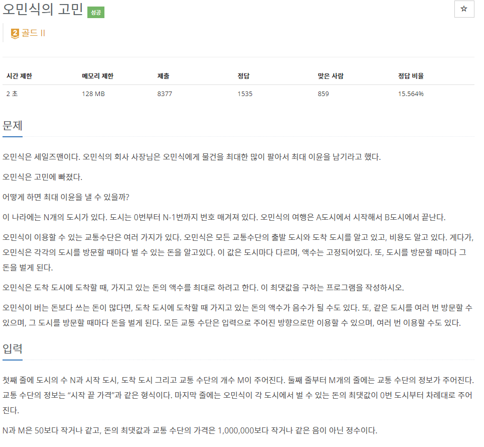
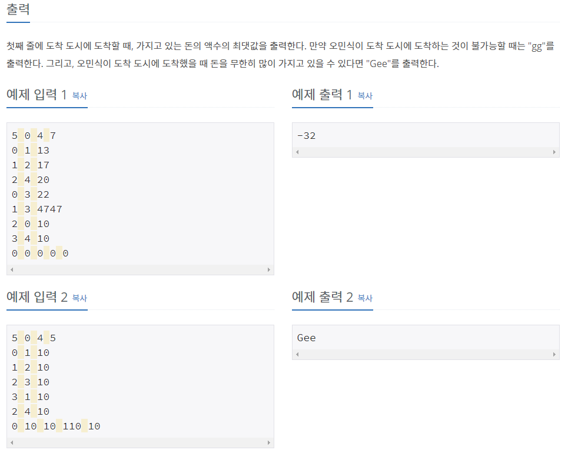

# [[1219] 오민식의 고민](https://www.acmicpc.net/problem/1219)



___
## 🤔접근
- 음의 가중치가 존재하므로, 벨만 포드 알고리즘을 사용하자.
- 벨만 포드 알고리즘은 음의 사이클만 찾아낼 수 있으므로, 가중치의 부호를 반대로 바꾸어 양의 사이클을 찾아내자.
- 양의 사이클이 존재하고, 도착지점까지 경로가 존재할 때만 `Gee`를 출력해야 한다.
___
## 💡풀이
- <b>알고리즘 & 자료구조</b>
	- `Bellman-Ford`
	- `DFS`
- <b>구현</b>
	- 가중치의 부호를 반대로 하여 정점 간 간선을 만들어 주고, 벨만 포드 알고리즘을 다음과 같이 약간 변형하였다.
		- n번째 순회 과정에서, 완화가 발생하면 사이클이 존재한다는 의미이다.
		- 여기서, DFS를 통해 도착 지점까지 경로가 있는지 파악한다.
		- 경로가 존재한다면 true를 반환한다.
	- 최종적으로 아래의 조건에 따라 출력해준다.
		- 도착지점까지 경로가 존재하지 않는 경우: `gg`
		- 벨만 포드 알고리즘 결과가 false인 경우: `Gee`
		- 그 외에는 `부호를 반대`로한 도착지점까지의 `최단 경로`를 출력해준다.
___
## ✍ 피드백
___
## 💻 핵심 코드
```c++
vector<bool> isVisited;
bool DFS(const vector<vector<pair<int, int>>> adj, const int cur, const int dest) {
	bool flag = false;
	if (cur == dest)
		return true;

	for (auto next : adj[cur]) {
		if (isVisited[next.first])
			continue;
		isVisited[next.first] = true;
		flag = (DFS(adj, next.first, dest) ? true : flag);
		isVisited[next.first] = false;
	}

	return flag;
}

bool bellman_ford(const vector<vector<pair<int, int>>> adj, vector<long long>& dist, const vector<long long>& money, const int& start, const int& dest) {
	int n = dist.size();
	bool flag = false;
	dist[start] = -money[start];

	for (int i = 0; i < n; i++) {
		for (int cur = 0; cur < n; cur++) {
			if (dist[cur] == INF)
				continue;

			for (auto next : adj[cur]) {
				if (dist[next.first] > -money[next.first] + dist[cur] + next.second) {
					dist[next.first] = -money[next.first] + dist[cur] + next.second;

					if (i == n - 1) {
						isVisited.assign(n, false);
						if (DFS(adj, next.first, dest))
							flag = true;
					}
				}
			}
		}
	}

	return flag;
}

int main() {
	...

	bool flag = bellman_ford(adj, dist, money, src, dest);

	if (dist[dest] == INF)
		cout << "gg";
	else if (flag) 
		cout << "Gee";
	else
		cout << -dist[dest];

	...
} 
```