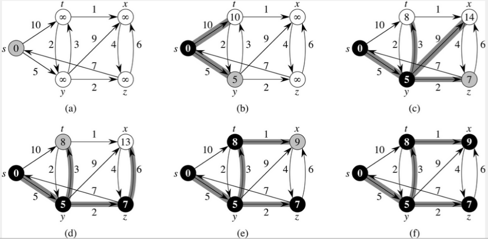

# 다익스트라(Dijkstra) 알고리즘

## 📖개념
- `단일 시작점` 최단 경로 알고리즘으로, 시작 정점에서 다른 정점들까지의 최단 경로를 계산할 수 있다.
- `우선순위 큐`를 사용하는 `BFS` 방식이며, 가중치가 `양수`일 때만 사용 가능하다.
	- 가중치가 `음수`이면, `무한 사이클`이 발생한다.
		> 가중치가 `음수`인 경우, `벨만포드(Bellman-Ford)` 알고리즘을 사용해야 한다.
- <b>시간 복잡도</b>
	- `O(|E|log₂|V|)`
- <b>시간 복잡도 분석</b>
	- 우선순위 큐에 추가되는 원소의 수는 최대 `O(|E|)`이다.
		- 추가는 각 간선마다 최대 한 번 일어나기 떄문이다.
	- 이 경우, 우선순위 큐에 원소를 추가/삭제하는 데는 `O(log₂|E|)`의 시간이 걸리고, `O(|E|)`개의 원소에 대해 작업을 해야하므로, 전체 시간 복잡도는 `O(|E|log²|E|)`가 됨을 알 수 있다.
	- 이 두 작업에 걸리는 시간을 더하면 `O(|E| + |E|log₂|E|)` = `O(|E|log²|E|)`가 되지만, 대부분의 그래프에서 간선의 개수 `|E|`는 `|V|²`보다 작기 떄문에 `O(log₂|E|)` = `O(log₂|V|)`라고 볼 수 있다.
	- 따라서 최종 시간 복잡도는 `O(|E|log₂|V|)`이 된다.
### 다익스트라(Dijkstra) 과정

___
## 💻구현
```c++
void dijkstra(const vector<vector<pair<int, int>>>& adj, vector<int>& dist, const int& start) {
	dist[start] = 0;

	priority_queue<pair<int, int>, vector<pair<int, int>>, greater<pair<int, int>>> pq;
	pq.emplace(0, start);

	while (!pq.empty()) {
		int curDist = pq.top().first;
		int pos = pq.top().second;
		pq.pop();

		if (dist[pos] < curDist)
			continue;

		for (auto dest : adj[pos]) {
			int nextPos = dest.first;
			int nextDist = dest.second;
			int sum = curDist + nextDist;

			if (dist[nextPos] > sum) {
				dist[nextPos] = sum;
				pq.emplace(sum, nextPos);
			}
		}
	}
}
```
