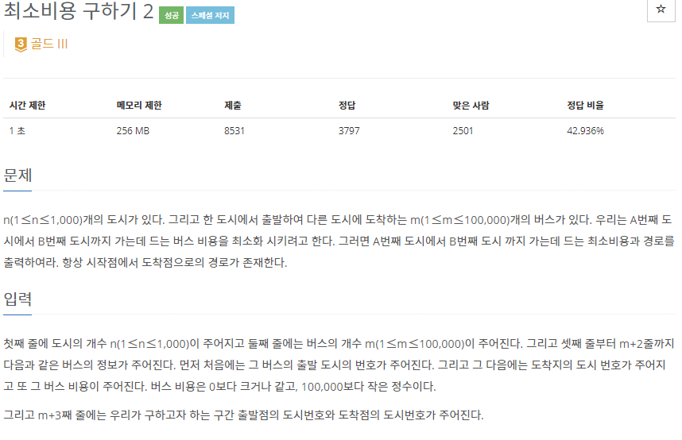

# [[11779] 최소비용 구하기 2](https://www.acmicpc.net/problem/11779)



___
## 🤔접근
1. <b>A번째 도시에서 B번째 도시 까지 가는데 드는 최소비용을 구하라.</b>
	- 한 정점에서 다른 정점까지의 최소 경로를 구하는 다익스트라 알고리즘을 이용하자.
2. <b>또한, 그 경로를 구하라.</b>
	- 가장 간단한 방법은 최단 경로를 갱신할 때마다, 도착 정점에 대한 출발 정점도 갱신해 주는 것이다.
		> ex) 경로[도착정점] = 출발정점
		> - 예를들어, 경로가 v1->v2->v3->v4 라고 한다면
		> - 경로[v4] = v3, 경로[v3] = v2, 경로[v2] = v1 을 순서대로 스택에 저장한 뒤, 다시 순서대로 pop하면 경로가 나온다.
___
## 💡풀이
- <b>다익스트라(Dijkstra) 알고리즘</b>을(를) 사용하였다.
___
## ✍ 피드백
1. <b>최단경로 문제에서 항상 출발->도착에서 `여러 경로`가 존재할 수 있다는 것에 주의하자❗</b>
	- 따라서, 입력 부분에서 동일 경로에 대해 다른 비용들이 들어온다면, 반드시 갱신해 주어야 한다.
___
## 💻 핵심 코드
```c++
// Dijkstra
	priority_queue<pair<int, int>, vector<pair<int, int>>, greater<pair<int, int>>> pq;
	vector<int> lastCity(n + 1);
	vector<int> citys(n + 1, INF);
	citys[start] = 0;
	pq.emplace(start, citys[start]);
	while (!pq.empty()) {
		int curCity = pq.top().first;
		int curCost = pq.top().second;
		pq.pop();

		if (citys[curCity] < curCost)
			continue;

		for (int nextCity = 1; nextCity <= n; nextCity++) {
			if (costs[curCity][nextCity] == NONE)
				continue;

			int nextCost = curCost + costs[curCity][nextCity];
			if (citys[nextCity] > nextCost) {
				citys[nextCity] = nextCost;
				lastCity[nextCity] = curCity; // renew the route
				pq.emplace(nextCity, nextCost);
			}
		}
	}

// Find route
	stack<int> route;
	int city = dest;
	while (city != start) {
		route.push(city);
		city = lastCity[city];
	}
	route.push(start);
```