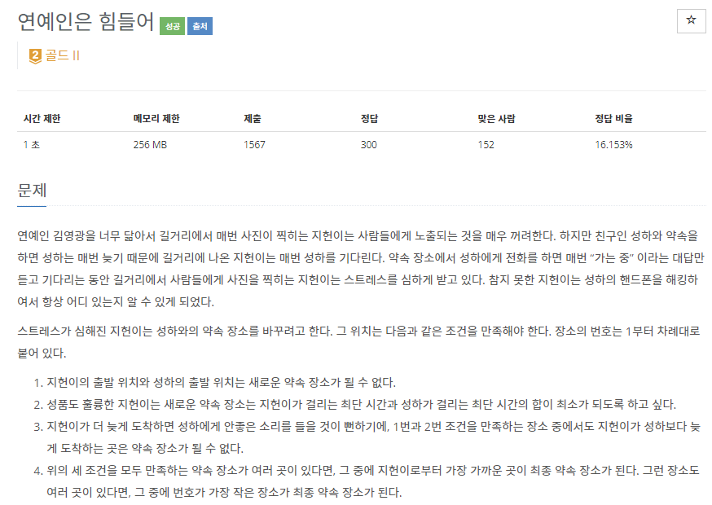
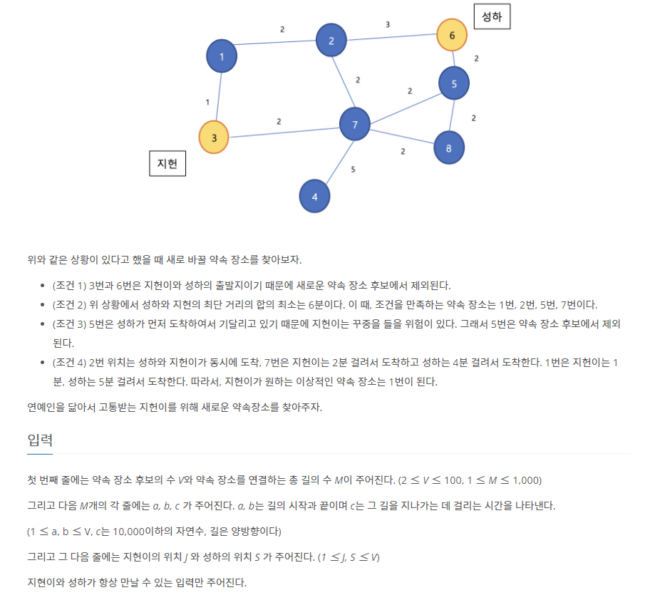
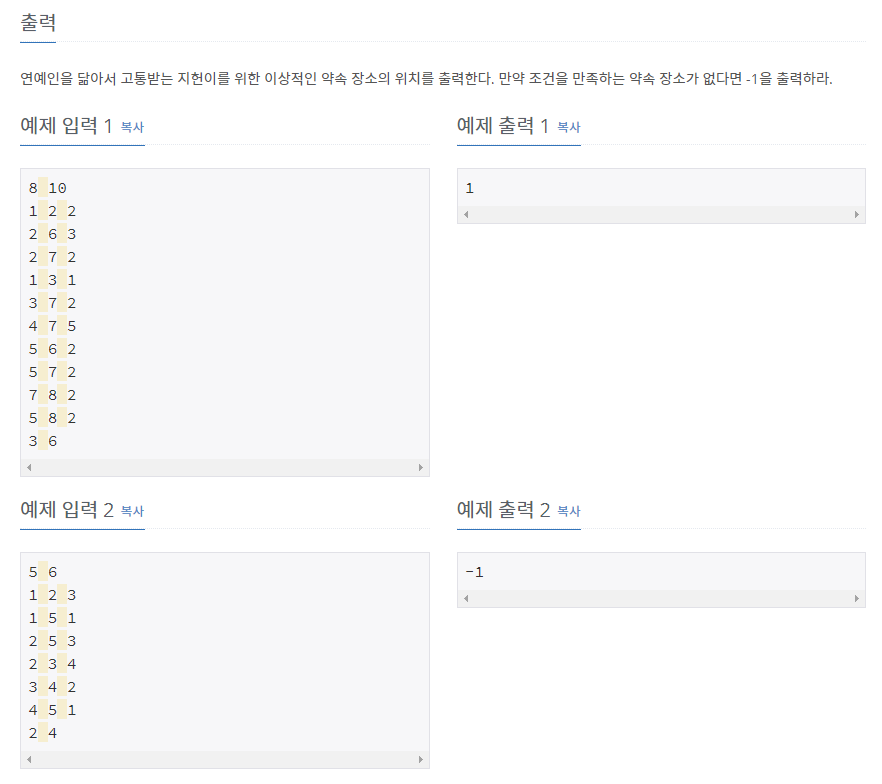

# [[17270] 연예인은 힘들어](https://www.acmicpc.net/problem/17270)




___
## 🤔접근
- 먼저, 성하와 지헌의 위치에서 각각 다익스트라 알고리즘을 수행하자.
	- 각 위치에서 성하와 지헌까지의 거리의 합의 최소를 구하자.
	- 지헌까지의 거리가 최소인 위치를 구하자.
	- 위치의 번호가 가장 낮은 위치를 구하자.
___
## 💡풀이
- <b>알고리즘</b>
	- `Dijkstra`
- <b>구현</b>
	- 성하와 지헌의 다익스트라 결과를 각각 `distS`, `distJ`에 저장하였다.
	- 그리고, 성하와 지헌의 위치를 제외한 모든 위치를 탐색하며, 성하와 지헌까지의 거리의 합의 최솟값을 찾았다.
	- 다음으로, 성하와 지헌의 위치를 제외한 모든 위치를 탐색하며, 아래의 순서대로 해답을 찾아나갔다.
		1. 지헌까지의 거리 <= 성하까지의 거리
		2. 지헌까지의 거리 + 성하까지의 거리 == minDist
		3. 지헌까지의 거리와 현재 위치를 우선순위 큐에 저장
		- 결국, 지헌까지의 거리가 가장 짧은 위치중에 번호가 가장 낮은 번호를 우선순위의 top에서 찾을 수 있게 된다.
___
## ✍ 피드백
___
## 💻 핵심 코드
```c++
int main(){
	...

	vector<int> distJ(V + 1, INF), distS(V + 1, INF);
	dijkstra(adj, distJ, J);
	dijkstra(adj, distS, S);

	int minDist = INF;
	for (int start = 1; start <= V; start++)
		if (start != J && start != S)
			minDist = min(minDist, distJ[start] + distS[start]);

	priority_queue<pair<int, int>, vector<pair<int, int>>, greater<pair<int, int>>> pq;
	for (int start = 1; start <= V; start++) 
		if (start != J && start != S)
			if (distJ[start] <= distS[start]) 
				if (distJ[start] + distS[start] == minDist)
					pq.emplace(distJ[start], start);

	cout << (pq.empty() ? -1 : pq.top().second);

	...
}

void dijkstra(const vector<vector<pair<int, int>>>& adj, vector<int>& dist, const int& start) {
	dist[start] = 0;

	priority_queue<pair<int, int>, vector<pair<int, int>>, greater<pair<int, int>>> pq;
	pq.emplace(0, start);

	while (!pq.empty()) {
		int curDist = pq.top().first;
		int pos = pq.top().second;
		pq.pop();

		if (dist[pos] < curDist)
			continue;

		for (auto dest : adj[pos]) {
			int nextPos = dest.first;
			int nextDist = dest.second;
			int sum = curDist + nextDist;

			if (dist[nextPos] > sum) {
				dist[nextPos] = sum;
				pq.emplace(sum, nextPos);
			}
		}
	}
}
```