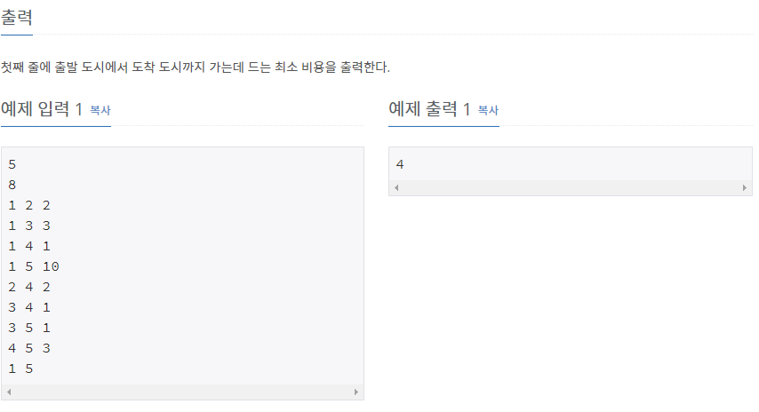

# [[1916] 최소비용 구하기](https://www.acmicpc.net/problem/1916)



___
## 🤔접근
1. <b>출발 도시에서 도착 도시까지 가는데 드는 최소 비용 구하기</b>
	- 양의 가중치가 존재하고, 1:N에 해당하므로 다익스트라 알고리즘을 이용하자.
___
## 💡풀이
- <b>다익스트라(Dijkstra) 알고리즘</b>을(를) 사용하였다.
___
## ✍ 피드백
___
## 💻 핵심 코드
```c++
priority_queue<pair<int, int>, vector<pair<int, int>>, greater<pair<int, int>>> pq;
vector<vector<int>> adj;
vector<int> cost;

int main(){
	...

	adj.assign(N + 1, vector<int>(N + 1, -1));
	cost.assign(N + 1, INF);

	for (int i = 0; i < M; i++) {
		int u, v, w;
		cin >> u >> v >> w;
		if (adj[u][v] == -1 || adj[u][v] > w)
			adj[u][v] = w;
	}

	...
}

int Dijkstra() {
	int start, dest;
	cin >> start >> dest;

	cost[start] = 0;
	pq.emplace(start, cost[start]);

	while (!pq.empty()) {
		int curCity = pq.top().first;
		int curCost = pq.top().second;
		pq.pop();

		if (cost[curCity] < curCost)
			continue;

		for (int nextCity = 1; nextCity <= N; nextCity++) {
			if (adj[curCity][nextCity] == -1)
				continue;

			int nextCost = curCost + adj[curCity][nextCity];
			if (cost[nextCity] > nextCost) {
				cost[nextCity] = nextCost;
				pq.emplace(nextCity, nextCost);
			}
		}
	}

	return cost[dest];
}
```