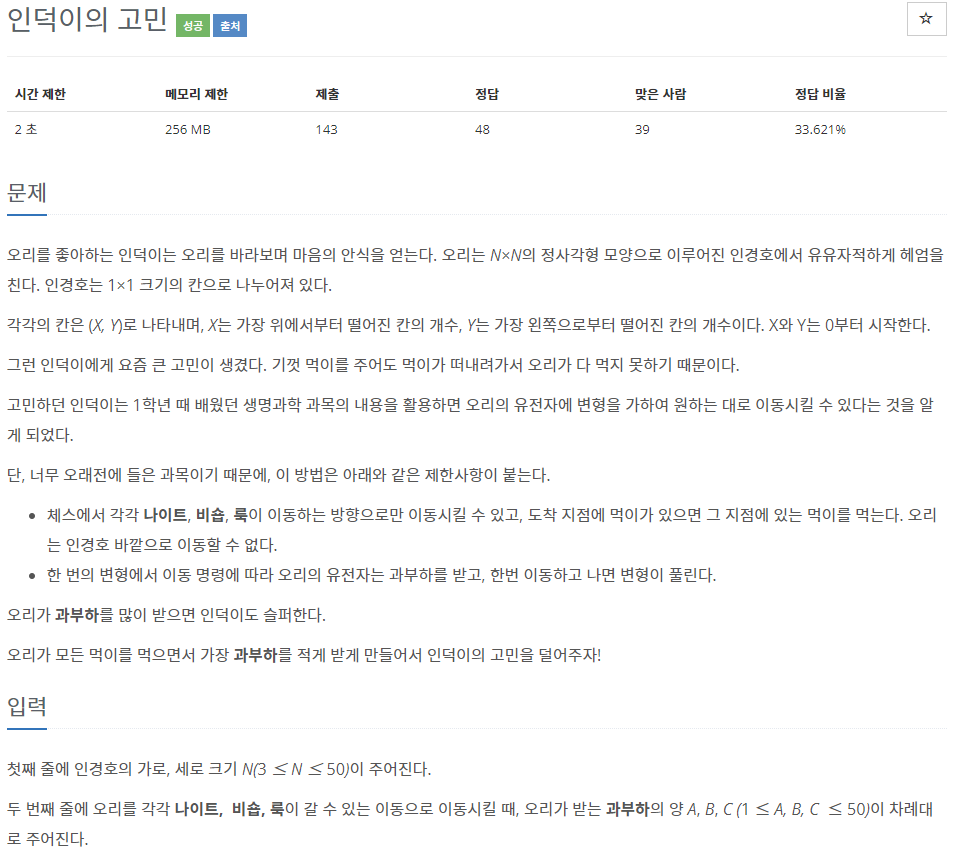
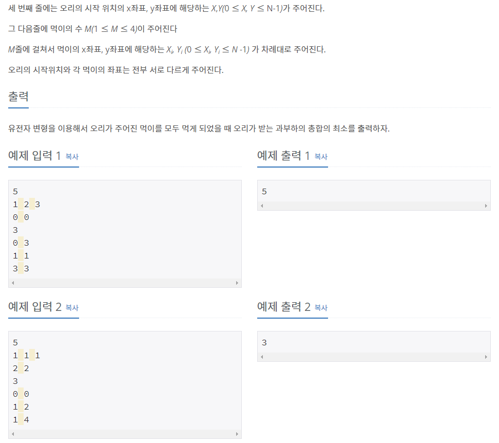

# [[20549] 인덕이의 고민](https://www.acmicpc.net/problem/20549)



___
## 🤔접근
- 시작점에서 먹이까지, 먹이에서 다른 먹이까지의 총 최단 경로를 구하는 문제이다.
	- 다익스트라 알고리즘을 이용하여 `시작점과 먹이`, `먹이와 먹이`간 최단 경로를 먼저 구하고,
	- `시작점 -> 먹이 -> 먹이 -> ... -> 먹이`의 최단 경로를 DFS을 이용하여 구하자.
___
## 💡풀이
- <b>알고리즘</b>
	- `Dijkstra`
	- `DFS`
- <b>구현</b>
	- 오리가 체스에서의 나이트, 비숍, 룩이 이동하는 방식으로 각각 움직일 수 있다.
		- 따라서, 다익스트라 알고리즘에서 해당 방식으로 이동을 하며 최단 경로를 갱신해주었다.
		- 시작점과 각 먹이를 출발 지점으로 하여 각각 다익스트라 알고리즘을 실행해주었다.
	- 해당 최단 경로 정보를 이용하여, 시작점 부터 DFS을 수행하면서 `시작점 -> 먹이 -> 먹이`의 최단 경로를 구하였다.
___
## ✍ 피드백
___
## 💻 핵심 코드
```c++
void dijkstra(vector<int>& dist, const int& start) {
	dist[start] = 0;

	priority_queue<pair<int, int>, vector<pair<int, int>>, greater<pair<int, int>>> pq;
	pq.emplace(0, start);

	while (!pq.empty()) {
		int curDist = pq.top().first;
		int pos = pq.top().second;
		int row = pos / N;
		int col = pos % N;
		pq.pop();

		if (dist[pos] < curDist)
			continue;

		// knight
		for (int k = 0; k < 8; k++) {
			int nextRow = row + knight_dr[k];
			int nextCol = col + knight_dc[k];

			if (nextRow < 0 || nextCol < 0 || nextRow >= N || nextCol >= N)
				continue;

			int nextPos = nextRow * N + nextCol;
			int nextDist = knight;
			int sum = curDist + nextDist;

			if (sum < dist[nextPos]) {
				dist[nextPos] = sum;
				pq.emplace(sum, nextPos);
			}
		}

		// bishop
		for (int m = 1; m < N; m++) {
			for (int k = 0; k < 4; k++) {
				int nextRow = row + m * bishop_dr[k];
				int nextCol = col + m * bishop_dc[k];

				if (nextRow < 0 || nextCol < 0 || nextRow >= N || nextCol >= N)
					continue;

				int nextPos = nextRow * N + nextCol;
				int nextDist = bishop;
				int sum = curDist + nextDist;

				if (sum < dist[nextPos]) {
					dist[nextPos] = sum;
					pq.emplace(sum, nextPos);
				}
			}
		}

		// rook
		for (int m = 1; m < N; m++) {
			for (int k = 0; k < 4; k++) {
				int nextRow = row + m * rook_dr[k];
				int nextCol = col + m * rook_dc[k];

				if (nextRow < 0 || nextCol < 0 || nextRow >= N || nextCol >= N)
					continue;

				int nextPos = nextRow * N + nextCol;
				int nextDist = rook;
				int sum = curDist + nextDist;

				if (sum < dist[nextPos]) {
					dist[nextPos] = sum;
					pq.emplace(sum, nextPos);
				}
			}
		}
	}
}

bool isVisited[5];
void DFS(const vector<int>& pos, const vector<vector<int>>& dist, int cur, int overload, int cnt) {
	if (cnt == M) {
		answer = min(answer, overload);
		return;
	}

	for (int i = 1; i <= M; i++) {
		if (isVisited[i])
			continue;

		isVisited[i] = true;
		DFS(pos, dist, i, overload + dist[cur][pos[i]], cnt + 1);
		isVisited[i] = false;
	}
}
```