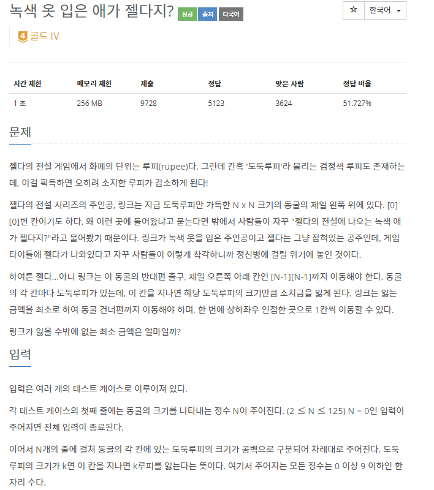
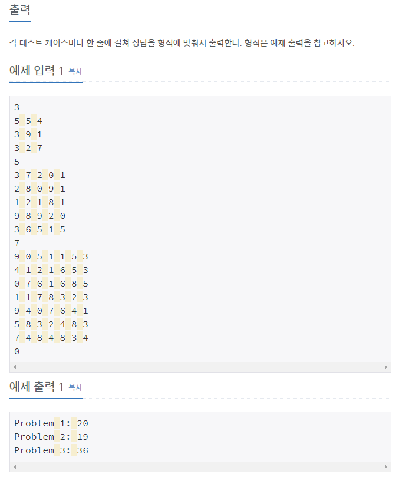

# [[4485] 녹색 옷 입은 애가 젤다지?](https://www.acmicpc.net/problem/4485)



___
## 🤔접근
1. <b>최소 비용으로 도착지점에 도달하기</b>
	- 가중치는 모두 음이 아닌 정수이며, 종류가 10가지이므로 `다익스트라` 알고리즘을 이용하자.
___
## 💡풀이
- <B>알고리즘 & 자료구조</B>
	- `Dijkstra`
- <b>구현</b>
	- 다익스트라 알고리즘을 구현하여 해결하였다.
___
## ✍ 피드백
___
## 💻 핵심 코드
```c++
int Dijkstra(const vector<vector<int>>& costs, const int& R, const int& C) {
	vector<vector<int>> pos(R, vector<int>(C, 1e9));
	priority_queue<pair<int, pair<int, int>>, vector<pair<int, pair<int, int>>>, greater<pair<int, pair<int, int>>>> pq;
	
	pos[0][0] = costs[0][0];
	pq.emplace(pos[0][0], make_pair(0, 0));

	while (!pq.empty()) {
		int cost = pq.top().first;
		int row = pq.top().second.first;
		int col = pq.top().second.second;
		pq.pop();

		if (pos[row][col] < cost)
			continue;

		for (int i = 0; i < 4; i++) {
			int nextRow = row + dr[i];
			int nextCol = col + dc[i];

			if (nextRow < 0 || nextCol < 0 || nextRow >= R || nextCol >= C)
				continue;
			if (pos[nextRow][nextCol] <= cost + costs[nextRow][nextCol])
				continue;
			
			pos[nextRow][nextCol] = cost + costs[nextRow][nextCol];
			pq.emplace(pos[nextRow][nextCol], make_pair(nextRow, nextCol));
		}
	}

	return pos[R - 1][C - 1];
}
```