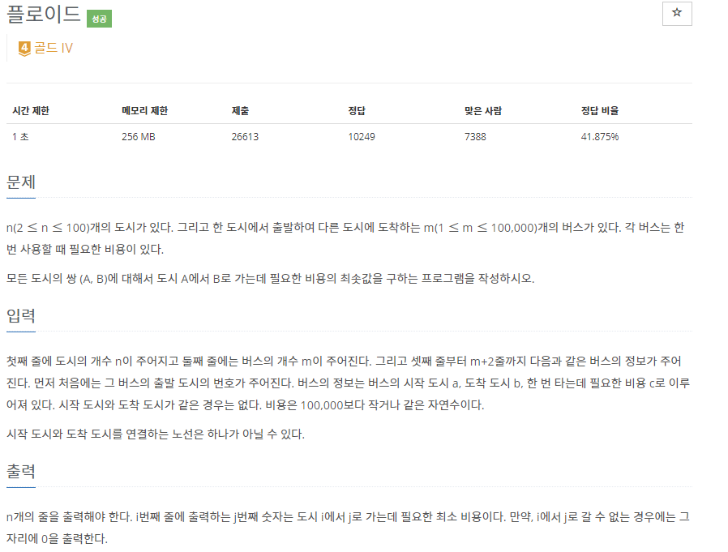
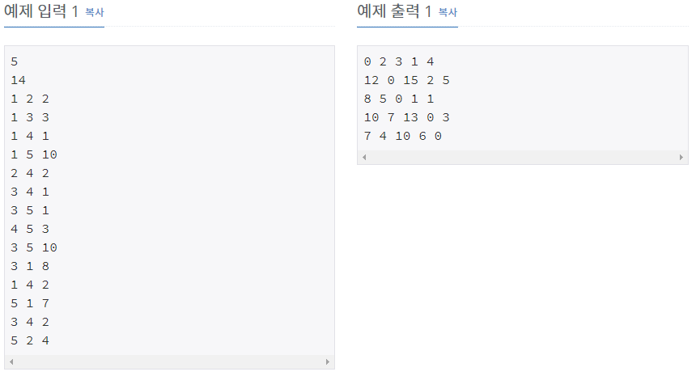

# [[11404] 플로이드](https://www.acmicpc.net/problem/11404)



___
## 🤔접근
1. <b>모든 도시의 쌍에 대해 최소 경로를 구해야 한다.</b>
	- 모든 정점의 쌍에 대한 최소 경로는 플로이드 와샬 알고리즘으로 구하는 것이 효율적이다.
___
## 💡풀이
- <b>플로이드 와샬 알고리즘</b>을(를) 이용하였다.
___
## ✍ 피드백
1. 시작 도시와 도착 도시를 연결하는 노선은 <b>하나가 아님</b>에 주의하자.
___
## 💻 핵심 코드
```c++
for (int mid = 1; mid <= n; mid++) {
	for (int start = 1; start <= n; start++) {
		if (weights[start][mid] == MAX) // 최적화
			continue;

		for (int end = 1; end <= n; end++) {
			if (start == end) // 사이클 방지
				continue;

			weights[start][end] = min(weights[start][end], weights[start[mid] + weights[mid][end]);
		}
	}
}
```