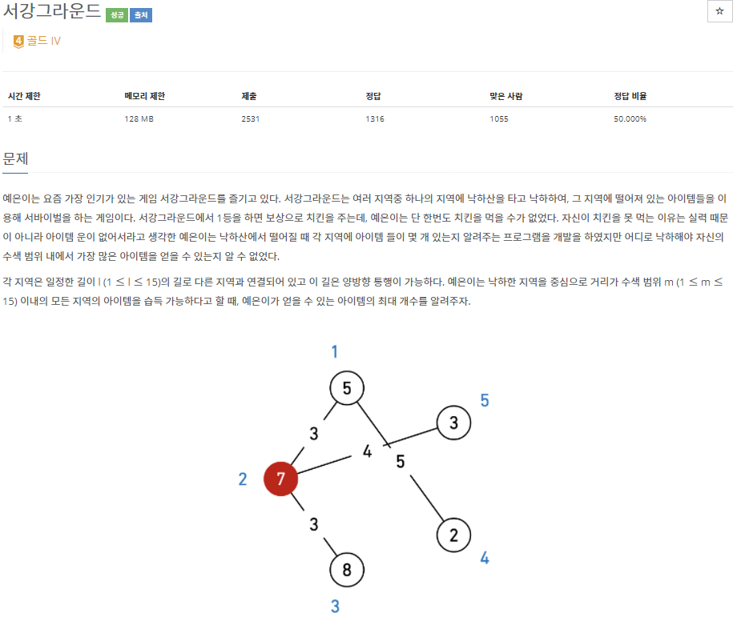
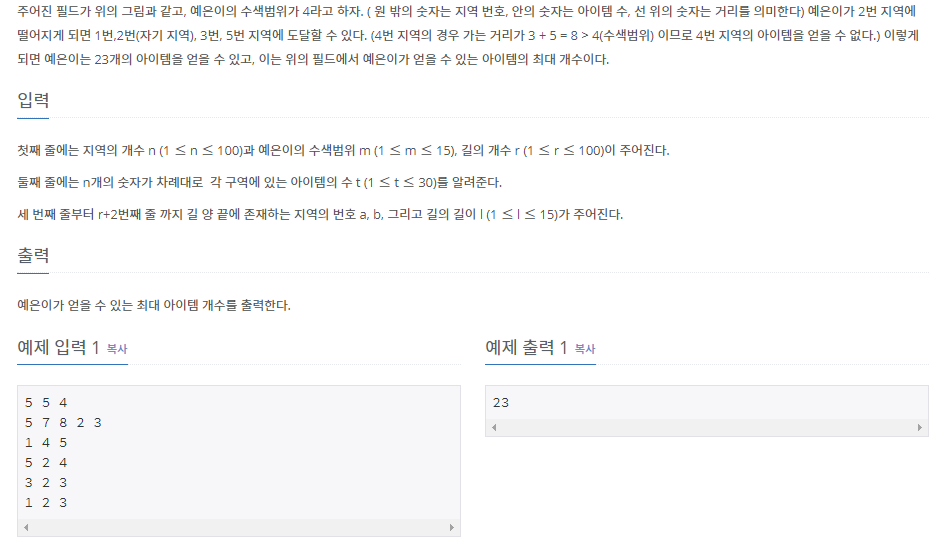

# [[14938] 서강그라운드](https://www.acmicpc.net/problem/14938)



___
## 🤔접근
1. <b>각 지역마다 m 이내의 거리인 지역들을 찾아야 한다.</b>
	- 모든 지역 쌍에 대한 최단거리를 구하기 위해 플로이드 와샬 알고리즘을 사용하자.
___
## 💡풀이
- <b>플로이드 와샬(Floyd-Warshall) 알고리즘</b>을(를) 사용하였다.
___
## ✍ 피드백
___
## 💻 핵심 코드
```c++
// 플로이드 와샬
for (int mid = 1; mid <= n; mid++) {
	for (int start = 1; start <= n; start++) {
		if (dist[start][mid] == MAX)
			continue;
		for (int end = 1; end <= n; end++) {
			if (start == end)
				continue;
			dist[start][end] = min(dist[start][end], dist[start][mid] + dist[mid][end]);
		}
	}
}

// 얻을 수 있는 아이템의 최대 개수 구하기
int max = 0;
int items;
for (int start = 1; start <= n; start++) {
	items = item[start];
	for (int end = 1; end <= n; end++) {
		if (start == end)
			continue;
		if (dist[start][end] <= m) // m 범위 이내 
			items += item[end];
	}
	if (max < items)
		max = items;
}

cout << max;
```