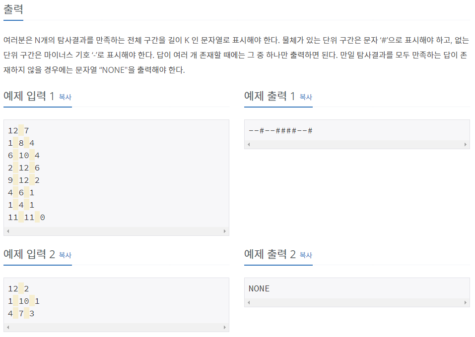

# [[7577] 탐사](https://www.acmicpc.net/problem/7577)



___
## 🤔접근
- `System of Difference Constraints` 문제이다.
	- 플로이드 와샬 혹은 벨만 포드 알고리즘으로 해결할 수 있다.
___
## 💡풀이
- <b>알고리즘 & 자료구조</b>
	- `Floyd Warshall`
- <b>구현</b>
	- <b>Solving System of Difference Constraints</b>
		- `X₁, X₂, ... Xn`과 `Xμ - Xν ≤ T` 꼴의 부등식 M개가 있을 때,<br>
		이를 만족하는 변수 `X₁, X₂, ... Xn`을 `최단 경로 알고리즘`을 이용하여 찾을 수 있다.
	- <b>초기 조건</b>
		- 먼저, 각 정점간의 간선 가중치를 `INF`으로, 자기 자신으로의 간선 가중치(사이클)은 `0`으로 초기화해준다.
		- 다음으로, i -> i + 1으로의 간선 가중치는 `1`, 그 반대는 `0`으로 초기화해준다.
			> 각 구간마다 물체가 존재한다고 가정한다는 의미
	- `Xμ - Xν ≤ T`일 때, `μ -> ν`으로 가는 `가중치 T의 간선`을 만들어준다.
		- 그 반대는 `가중치 -T의 간선`을 만들어준다.
	- 이제 플로이드 와샬 알고리즘을 수행한 후, 만약 `자기 자신으로의 간선 가중치(사이클)이 음수`인 부분이 있다면, 식을 만족하는 해가 없다는 뜻이다.
		- 그렇지 않다면, `0번 정점에서 i + 1번 정점까지의 간선 가중치 - 0번 정점에서 i번 정점까지의 간선 가중치`를 구함으로써 각각 i + 1번째에 대한 답을 얻어낼 수 있다.
___
## ✍ 피드백
___
## 💻 핵심 코드
```c++
void floyd_warshall(vector<vector<int>>& adj) {
	int n = adj.size() - 1;

	for (int mid = 0; mid <= n; mid++) {
		for (int start = 0; start <= n; start++) {
			if (adj[start][mid] == INF)
				continue;

			for (int end = 0; end <= n; end++) 
				adj[start][end] = min(adj[start][end], adj[start][mid] + adj[mid][end]);
		}
	}
}

int main() {
	...

	vector<vector<int>> adj(K + 1, vector<int>(K + 1, INF));
	for (int i = 0; i <= K; i++)
		adj[i][i] = 0;

	for (int i = 0; i < K; i++) {
		adj[i + 1][i] = 0;
		adj[i][i + 1] = 1;
	}

	for (int i = 0; i < N; i++) {
		int x, y, r;
		cin >> x >> y >> r;

		adj[x - 1][y] = min(adj[x - 1][y], r);
		adj[y][x - 1] = -r;
	}

	floyd_warshall(adj);

	for (int i = 0; i <= K; i++) {
		if (adj[i][i] < 0) {
			cout << "NONE";
			return 0;
		}
	}

	for (int i = 0; i < K; i++)
		cout << (adj[0][i + 1] - adj[0][i] ? '#' : '-');

	...
} 
```