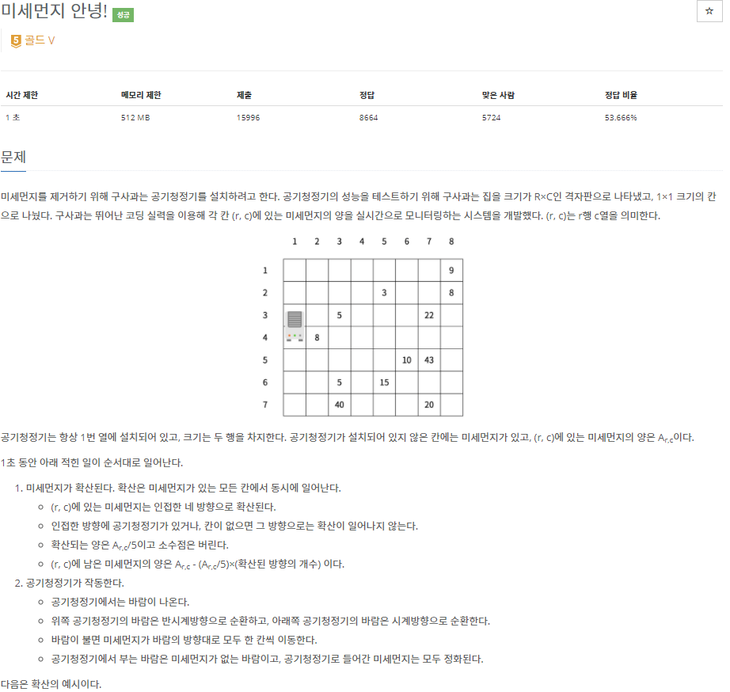
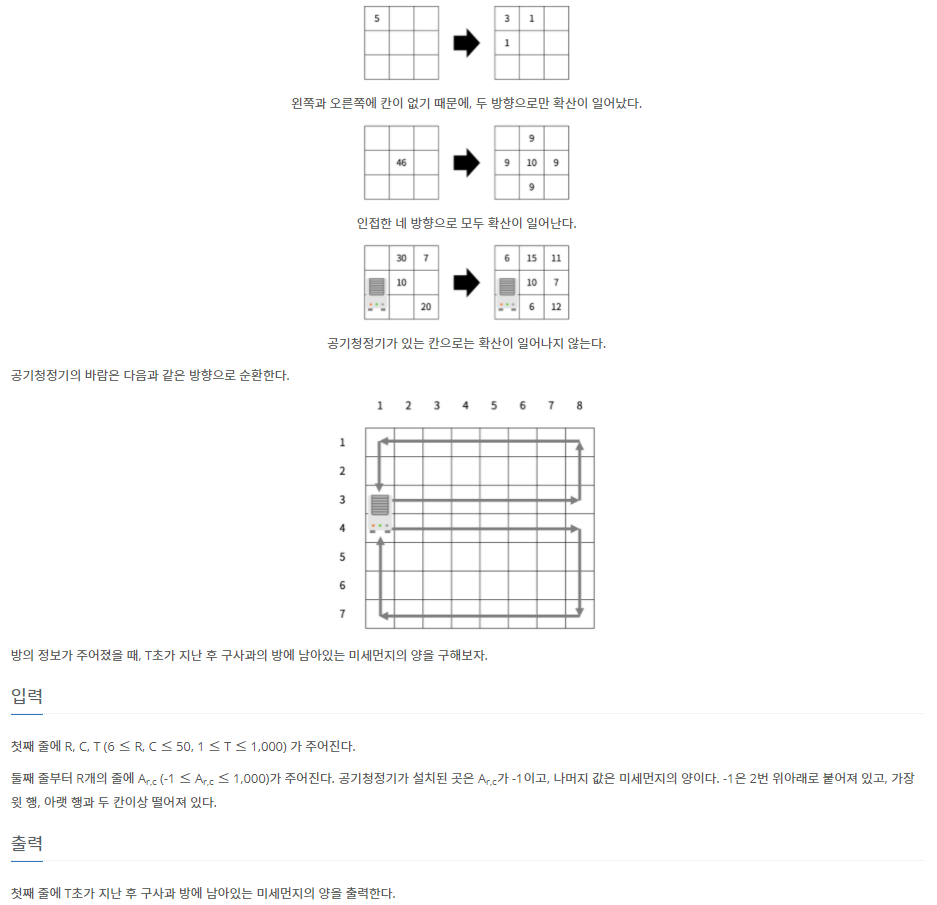
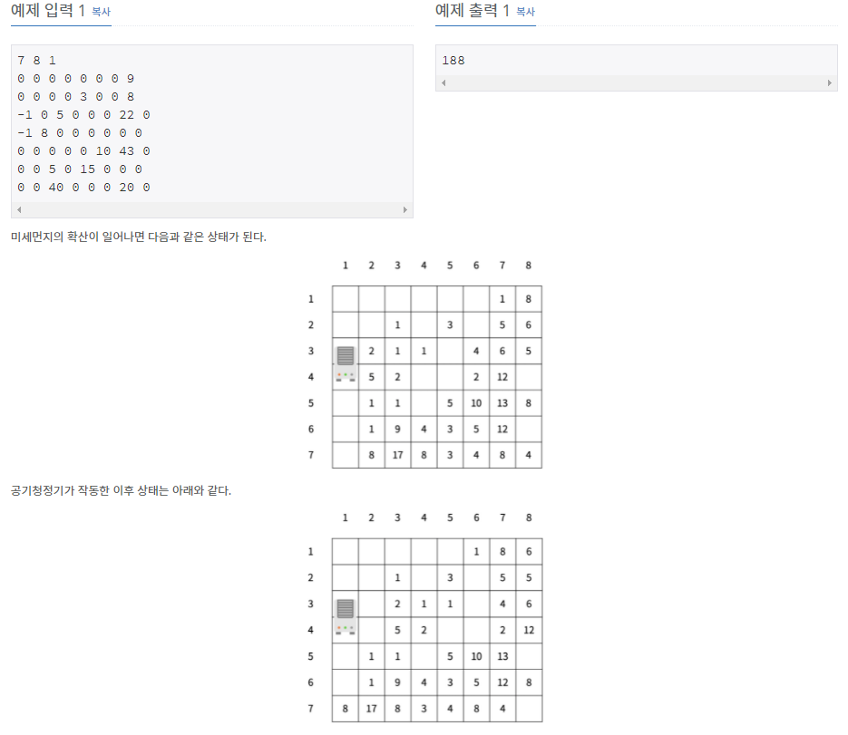

# [[17144] 미세먼지 안녕!](https://www.acmicpc.net/problem/17144)




___
## 🤔접근
1. <b>주어진 조건을 그대로 구현하는 문제이다.</b>
___
## 💡풀이
- <b>시뮬레이션</b> 문제이다.
	- 미세먼지 확산 -> 공기청정기 작동 순서로 진행한다.
	- <b>미세먼지 확산</b>
		1. 우선, 매 초마다 확산 가능한 미세먼지 위치를 파악한다.
		2. 파악한 미세먼지 농도를 따로 저장하고, 이 정보를 사용하여 가능한 방향으로 확산시킨다.
			- 인덱스 범위를 벗어나거나, 공기청정기를 제외한 네 방향으로 확신시킨다.
			- 현재 위치의 미세먼지 농도를 확산시킨 농도만큼 감소시킨다.
	- <b>공기청정기 작동</b>
		1. 공기청정기에서 나오는 바람의 방향 반대 순서로 미세먼지를 이동시켜야 한다.
	- 마지막으로 모든 미세먼지의 농도를 계산한다.
__
## ✍ 피드백
___
## 💻 핵심 코드
```c++
for (int i = 0; i < T; i++) {
	// 확산 가능한 미세먼지 위치 파악
	queue<pair<int, int>> dust;
	for (int i = 0; i < R; i++) {
		for (int j = 0; j < C; j++) {
			if (air[i][j] > 4)
				dust.emplace(i, j);
		}
	}
	int size = dust.size();

	// 현재 미세먼지 농도 저장
	vector<int> amount;
	int dr[] = {1, -1, 0, 0};
	int dc[] = {0, 0, 1, -1};
	for (int i = 0; i < size; i++) {
		int row = dust.front().first;
		int col = dust.front().second;
		dust.push(dust.front());
		dust.pop();
		amount.push_back(air[row][col]);
	}

	// 1. 미세먼지 확산
	for (int i = 0; i < size; i++) {
		int row = dust.front().first;
		int col = dust.front().second;
		dust.pop();

		int cnt = 0;
		int spread = amount[i] / 5;
		for (int i = 0; i < 4; i++) {
			int newRow = row + dr[i];
			int newCol = col + dc[i];
			if (newRow < 0 || newRow >= R || newCol < 0 || newCol >= C)
				continue;
			if (air[newRow][newCol] == -1)
				continue;

			cnt++;
			air[newRow][newCol] += spread;
		}
		air[row][col] -= cnt * spread;
	}

	// 2. 공기청정기 작동
	for (int row = airCleaner[0] - 1; row > 0; row--)
		air[row][0] = air[row - 1][0];
	for (int row = airCleaner[1] + 1; row < R - 1; row++)
		air[row][0] = air[row + 1][0];

	for (int col = 0; col < C - 1; col++) {
		air[0][col] = air[0][col + 1];
		air[R - 1][col] = air[R - 1][col + 1];
	}

	for (int row = 0; row < airCleaner[0]; row++)
		air[row][C - 1] = air[row + 1][C - 1];
	for (int row = R - 1; row > airCleaner[1]; row--)
		air[row][C - 1] = air[row - 1][C - 1];

	for (int col = C - 1; col > 1; col--) {
		air[airCleaner[0]][col] = air[airCleaner[0]][col - 1];
		air[airCleaner[1]][col] = air[airCleaner[1]][col - 1];
	}
	air[airCleaner[0]][1] = 0;
	air[airCleaner[1]][1] = 0;
}
```