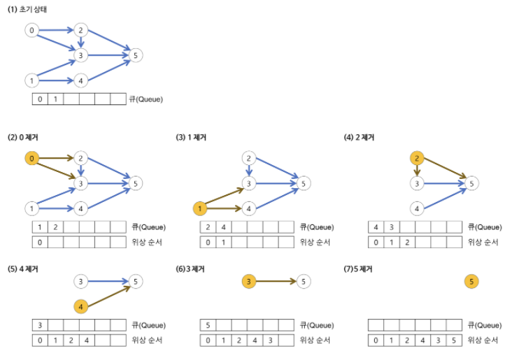

# 위상 정렬(Topological Sort) 알고리즘

## 📖개념
- <b>순서가 정해져 있는 작업들을 차례대로 수행해야 할 때, 그 순서를 결정해주는 알고리즘이다.</b>
    - 순차적으로 어떤 그래프가 형성되어 있을 때, 그 그래프를 하나의 경로로 나타내는 것이다.
- <b>특징</b>
    - 경로는 여러 나열 방법이 있을 수 있기 때문에, `답이 다양하게` 나올 수 있는 알고리즘이다.
    - `DAG(Directed Acyclic Graph)`에만 적용할 수 있다.
    - 스택이나 큐를 이용하여 구현할 수 있다.
- <b>큐를 이용한 위상 정렬 원리</b>
    1. `진입 차수`가 0인 노드를 큐에 push.
        > `진입 차수`: 특정한 노드가 있을 때, 그 노드로 들어오는 다른 노드의 수
    2. 큐에서 원소를 꺼내어 연결된 간선을 모두 제거하고, 연결되었던 노드들의 진입 차수를 1씩 감소시킨다.
    3. 진입 차수가 0이 된 노드는 큐에 push.
    4. 큐가 empty 상태가 될 때까지 위의 과정을 반복한다.
        - 만약, 모든 원소 방문 전에 큐가 empty 상태가 된다면, 사이클이 존재한다는 뜻이다.
- <b>진행 과정</b>
    - 
- <b>시간 복잡도</b>
    - `O(|V| + |E|)`
___
## 💻구현
```c++
int N;
vector<int> inDegree(N + 1);
vector<vector<int>> adj(N + 1, vector<int>());
vector<int> result(N + 1);

void input(){
    int n1, n2;
    for (int i = 0; i < M; i++) {
    	cin >> n1 >> n2;
    	people[n1].push_back(n2);
    	degree[n2]++;
    }
}

bool topologicalSort(){
    queue<int> q;
    for (int i = 1; i <= N; i++)
    	if (degree[i] == 0)
    		q.push(i);

    for(int i = 1; i <= N; i++) {
        if (q.empty())
            return false;

    	int cur = q.front();
    	q.pop();
    	result[i] = cur;

    	for (int i = 0; i < people[cur].size(); i++) {
    		int next = people[cur][i];
    		if (--degree[next] == 0)
    			q.push(next);
    	}
    }
    return true;
}
```