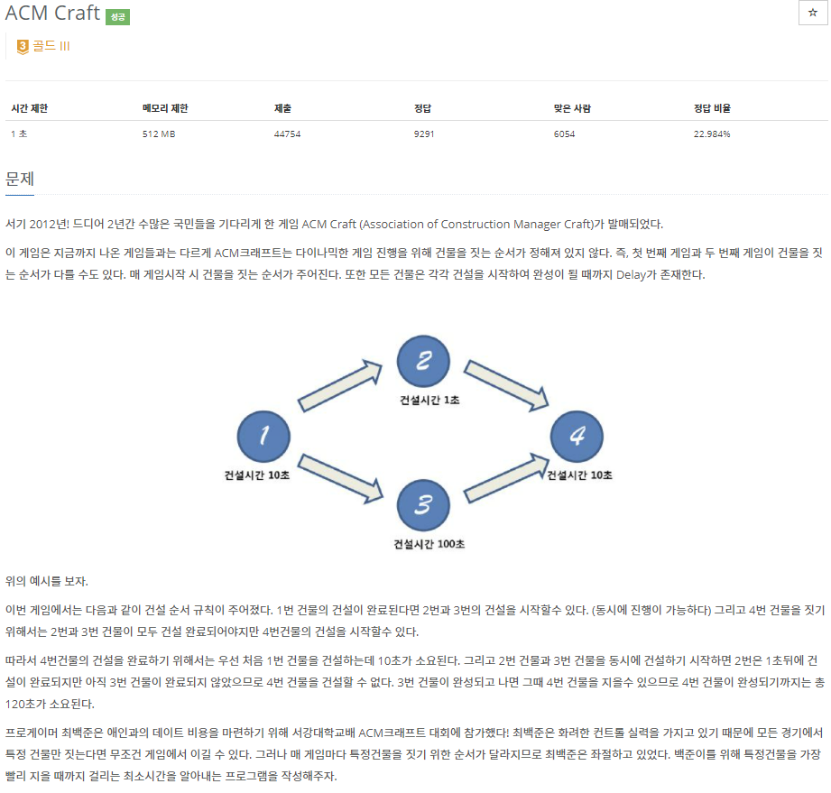
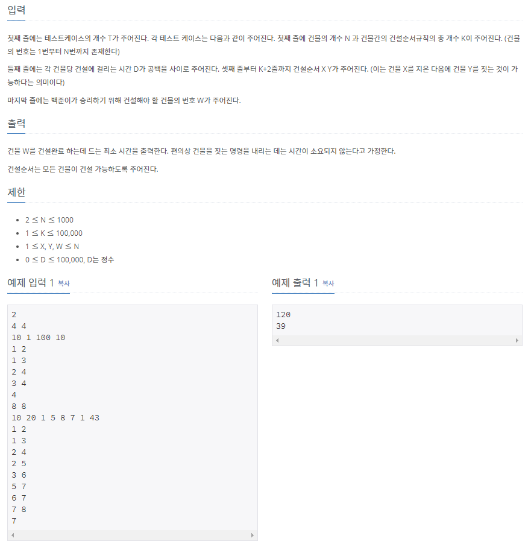

# [[1005] ACM Craft](https://www.acmicpc.net/problem/1005)



___
## 🤔접근
1. <b>주어진 선행 건설 정보를 토대로, 전체적인 건설 순서를 구하자.</b>
	- 위상 정렬 알고리즘을 이용하자.
2. <b>선행 건설이 두 개 이상인 경우, 둘 중 더 오래 걸리는 시간이 지나야 한다.</b>
	- 동적계획법을 이용하자.
	- `다음 건설 시간`과 `(현재까지의 건설 시간을 더한 값 + 다음 건설 시간)` 중 큰 값을 다음까지의 건설 시간에 저장하자.
___
## 💡풀이
- <b>위상 정렬(Topological Sort), 동적계획법(DP) 알고리즘</b>을(를) 사용하였다.
__
## ✍ 피드백
___
## 💻 핵심 코드
```c++
while (T--) {
	cin >> N >> K;

	vector<int> dp(N + 1);
	vector<int> delay(N + 1);
	vector<int> inDegree(N + 1);
	vector<vector<int>> adj(N + 1, vector<int>());

	for (int i = 1; i <= N; i++)
		cin >> delay[i];

	int n1, n2;
	for (int i = 0; i < K; i++) {
		cin >> n1 >> n2;
		adj[n1].push_back(n2);
		inDegree[n2]++;
	}

	int number;
	cin >> number;

	queue<int> q;
	for (int i = 1; i <= N; i++) {
		if (inDegree[i] == 0)
			q.push(i);
		dp[i] = delay[i]; // 선행 건설이 없는 경우를 위해
	}

	while (!q.empty()) {
		int cur = q.front();
		q.pop();

		for (int i = 0; i < adj[cur].size(); i++) {
			int next = adj[cur][i];
			dp[next] = max(dp[next], dp[cur] + delay[next]);
			if (--inDegree[next] == 0) 
				q.push(next);
		}
	}

	result.push_back(dp[number]);
}
```