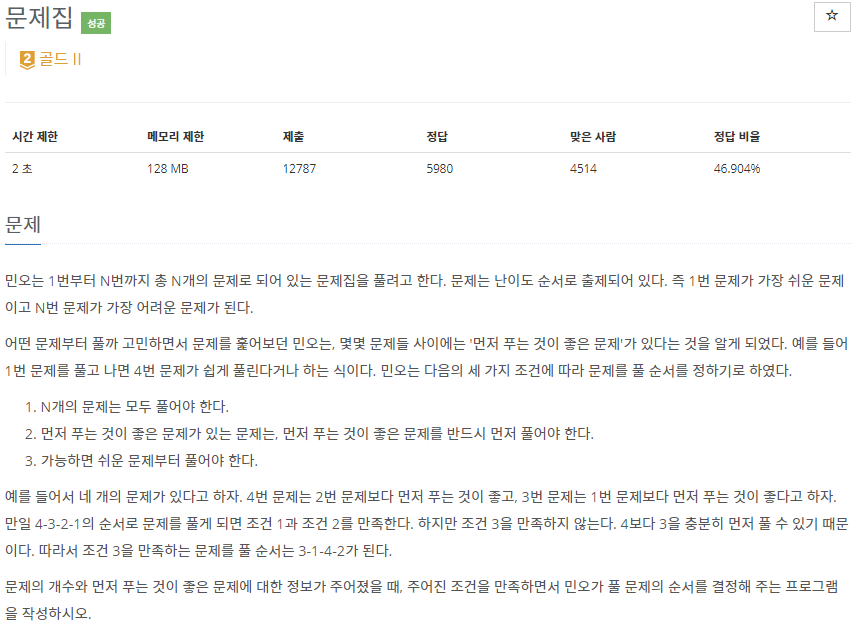
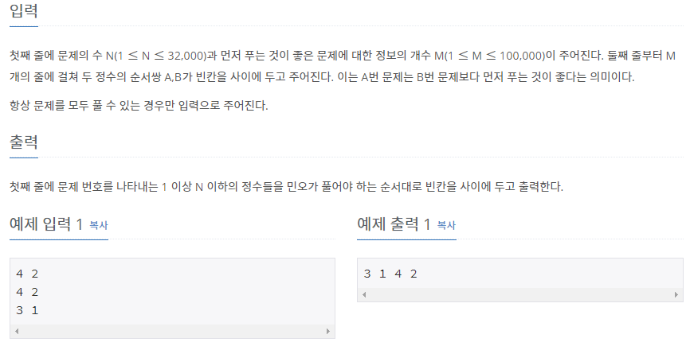

# [[1766] 문제집](https://www.acmicpc.net/problem/1766)



___
## 🤔접근
1. <b>주어진 풀 문제의 순서의 정보를 바탕으로 풀어야 하는 순서를 알아내야 한다.</b>
	- 위상 정렬 알고리즘을 이용하자.
2. <b>가능하면 쉬운 문제부터 풀어야 한다.</b>
	- 난이도가 낮은 문제에 우선순위를 크게 두어, 진입 차수가 0인 문제를 우선순위 큐에 삽입하자.
___
## 💡풀이
- <b>위상 정렬(Topological Sort) 알고리즘, 우선순위 큐</b>을(를) 사용하였다.
__
## ✍ 피드백
___
## 💻 핵심 코드
```c++
for (int i = 0; i < M; i++) {
	cin >> n1 >> n2;
	adj[n1].push_back(n2);
	inDegree[n2]++;
}

priority_queue<int, vector<int>, greater<int>> q;
for (int i = 1; i <= N; i++) 
	if (inDegree[i] == 0) 
		q.push(i);

while (!q.empty()) {
	int cur = q.top();
	q.pop();

	cout << cur << ' ';
	
	for (int j = 0; j < adj[cur].size(); j++) {
		int next = adj[cur][j];
		if (--inDegree[next] == 0)
			q.push(next);
	}
}
```