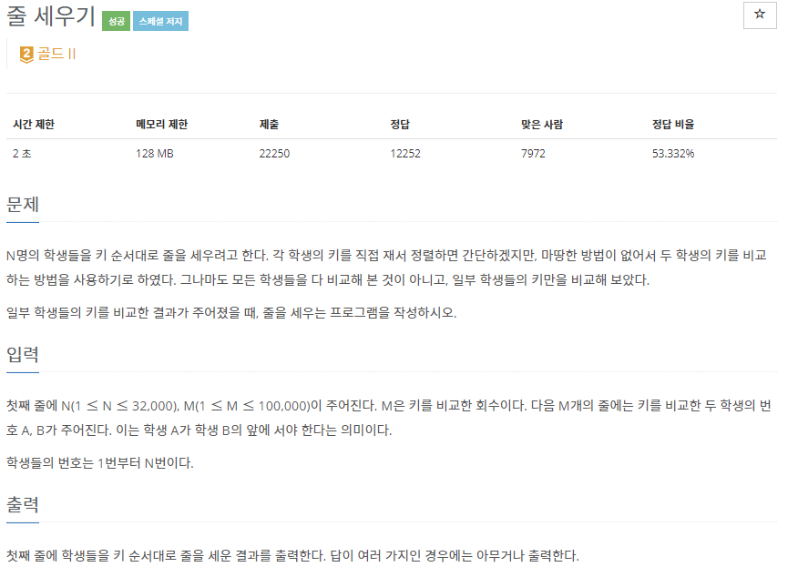
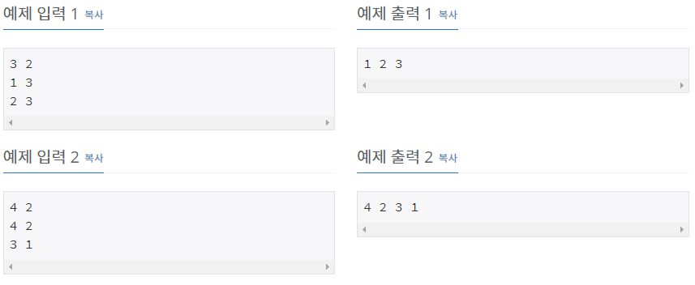

# [[2252] 줄 세우기](https://www.acmicpc.net/problem/2252)



___
## 🤔접근
1. <b>일부 학생들의 두 학생의 키를 비교한 정보를 통하여 학생들을 키 순서대로 줄을 세워야 한다.</b>
	- 입력으로 주어진 키 순서대로 학생들을 정렬해야 한다.
	- 위상 정렬 알고리즘을 이용하자.
___
## 💡풀이
- <b>위상 정렬(Topological Sort) 알고리즘</b>을(를) 사용하였다.
__
## ✍ 피드백
___
## 💻 핵심 코드
```c++
for (int i = 0; i < M; i++) {
	cin >> n1 >> n2;
	people[n1].push_back(n2);
	degree[n2]++;
}

queue<int> q;
for (int i = 1; i <= N; i++)
	if (degree[i] == 0)
		q.push(i);

while(!q.empty()) {
	int cur = q.front();
	q.pop();
	cout << cur << ' ';
	for (int i = 0; i < people[cur].size(); i++) {
		int next = people[cur][i];
		if (--degree[next] == 0)
			q.push(next);
	}
}
```