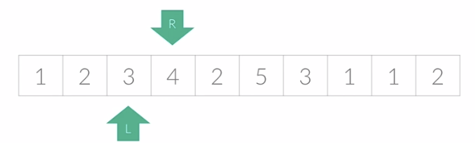

# 투 포인터(Two Pointer) 알고리즘

## 📖개념
<br>
- <b>어떠한 리스트에 순차적으로 접근해야 할 때, `두 개의 점의 위치를 기록하면서 처리`하는 알고리즘</b>
    - 정렬되어 있는 두 리스트의 합집합에도 사용할 수 있다.
        > ex) 병합 정렬(Merge Sort)의 Conquer 영역의 base
- <b>주요 예제</b>
    - 특정합을 만족하는 `부분합`에 대한 정보(수열, 길이 등) 구하기.
        - <b>구현 방법</b>
            1. 시작점과 끝점이 첫 번째 원소의 인덱스를 가리키고, 반복문에 진입한다.
            2. 현재 부분합이 특정합을 만족한다면, process
                > process: 수열 저장, 길이 저장 등
            3. 현재 부분합이 특정합 이상이면 first pointer를 1 증가시킨다.
            4. 그렇지 않다면, last pointer를 1 증가시킨다.
            5. first > last 또는 last 인덱스 범위 이탈 시, 반복문을 종료한다.
- <b>비교: `슬라이딩 윈도우(Sliding Window)` 알고리즘</b>
    - `어느 순간에도 구간의 넓이가 동일하게` 리스트를 순차적으로 탐색하는 알고리즘이다.
- <b>시간 복잡도</b>
    - `O(N))`
___
## 💻구현
```c++
// 문제: 특정 합(S)이상임을 만족하는 부분합의 최소 길이 구하기(boj. 1806)
int main(){
    int N, S; // N: 수열의 길이
	cin >> N >> S;

	vector<int> sum(N + 1); // 누적합
	for (int i = 1; i <= N; i++) {
		cin >> sum[i];
		sum[i] += sum[i - 1];
	}

	if (sum[N] - sum[0] < S) {
		cout << 0;
		return 0;
	}

	int first = 1, last = 1; // 투 포인터
	int len = N + 1;
	while (first <= last && last <= N) {
		if (last <= N && sum[last] - sum[first - 1] >= S) {
			len = min(len, last - first + 1);
			first++;
		}
		else
			last++;
	}
	
	cout << len;
}

```