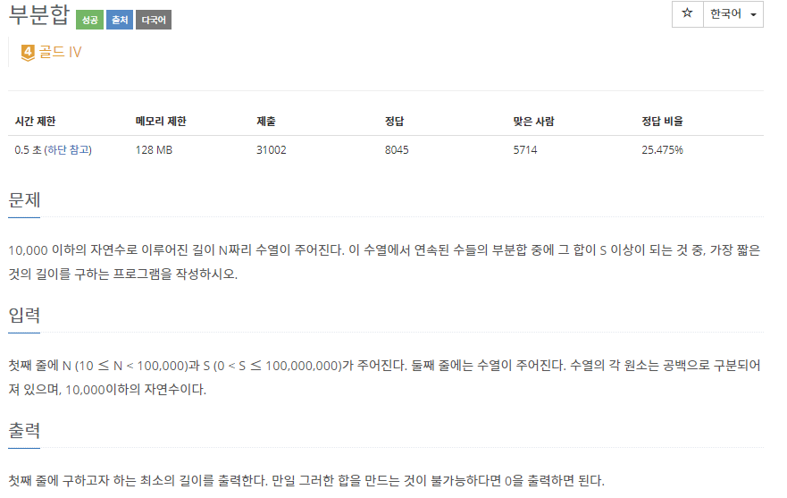
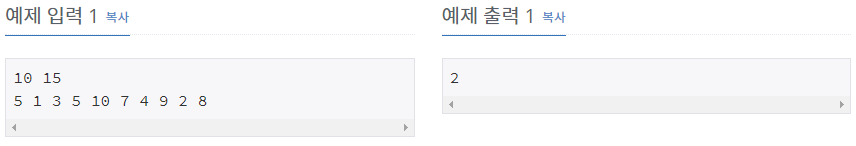

# [[1806] 부분합](https://www.acmicpc.net/problem/1806)



___
## 🤔접근
1. <b>합이 S 이상인 부분합 수열의 최소 길이를 구하자.</b>
	- 처음에는 2중 for문으로 접근하려 했지만, 최대 10만²번의 연산으로 시간 초과가 예상되어 생각을 바꾸었다.
	- 투 포인터 알고리즘을 이용하면 `O(N)`에 찾을 수 있다!
	___
## 💡풀이
- <b>투 포인터(Two-Pointers) 알고리즘</b>을(를) 사용하였다.
	- 우선 각 i번째까지의 누적합 데이터를 얻어낸다.
	- 만약, 모든 데이터의 합이 S 미만이라면, 부분합으로 S를 만드는 것이 불가능하다는 뜻이다.
	- 투 포인터(first, last)에 인덱스 위치를 담고, 아래와 같이 구현하였다.
		- 처음 first, last에는 1번째 위치를 담고, 반복문으로 들어간다.
		1. first ~ last 부분합이 S 이상이라면
			- len(부분합의 최소 길이)을 갱신하고, first 인덱스를 증가시킨다.
		2. 그렇지 않다면 last 인덱스를 증가시킨다.
		3. first가 last를 넘어서거나, last가 인덱스 범위를 벗어나면 반복문을 종료한다.
__
## ✍ 피드백
___
## 💻 핵심 코드
```c++
int main(){
	...

	vector<int> sum(N + 1);
	for (int i = 1; i <= N; i++) {
		cin >> sum[i];
		sum[i] += sum[i - 1];
	}

	if (sum[N] - sum[0] < S) {
		cout << 0;
		return 0;
	}

	int first = 1, last = 1;
	int len = N + 1;
	while (first <= last && last <= N) {
		if (last <= N && sum[last] - sum[first - 1] >= S) {
			len = min(len, last - first + 1);
			first++;
		}
		else
			last++;
	}
	
	cout << len;
	
	...
}
```