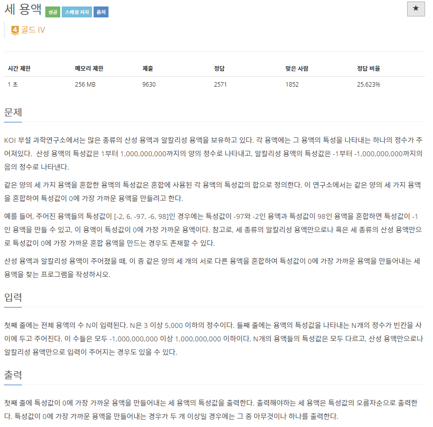
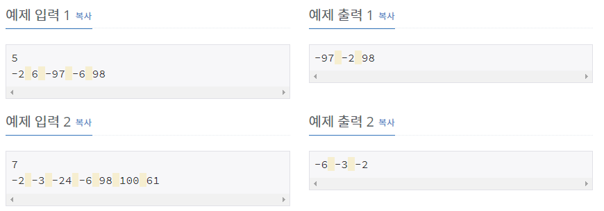

# [[2473] 세 용액](https://www.acmicpc.net/problem/2473)



___
## 🤔접근
1. <b>한 용액을 선택하고, 나머지 두 용액은 범위를 좁혀가며 탐색해서 선택하자.</b>
	- 투 포인터 알고리즘을 이용하여 각각 i + 1, N - 1부터 시작해서 범위를 좁혀가며 탐색하자.
___
## 💡풀이
- <B>투 포인터(Two Pointer) 알고리즘</B>을(를) 사용하였다.
	- 세 용액의 합이 0보다 작으면, left 포인터를 증가시키고, 그 반대라면, right 포인터를 감소시키면서 탐색하였다.
	- 탐색과 동시에 세 용액의 합의 절댓값이 가장 0에 근접한다면, 갱신해주었다.
	- 시간 복잡도: `O(N²)`
___
## ✍ 피드백
___
## 💻 핵심 코드
```c++
int main() {
	...

	for (int i = 0; i < N - 2; i++) {
		int left = i + 1, right = N - 1;
		while (left < right) {
			long long sum = v[i] + v[left] + v[right];
			if (abs(sum) < min3Sum) {
				min3Sum = abs(sum);
				ans[0] = i;
				ans[1] = left;
				ans[2] = right;
			}
			if (sum < 0)
				left++;
			else
				right--;
		}
	}

	...
}
```